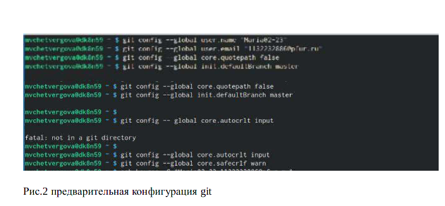
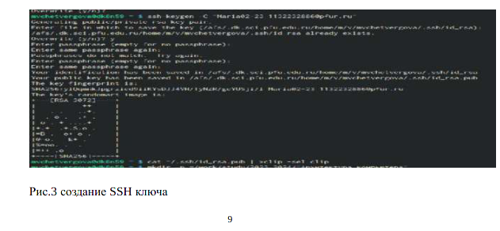
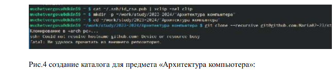
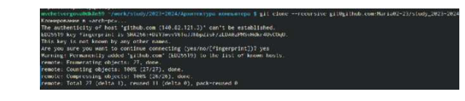
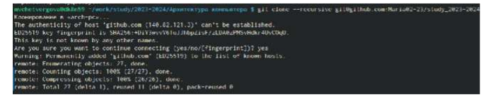
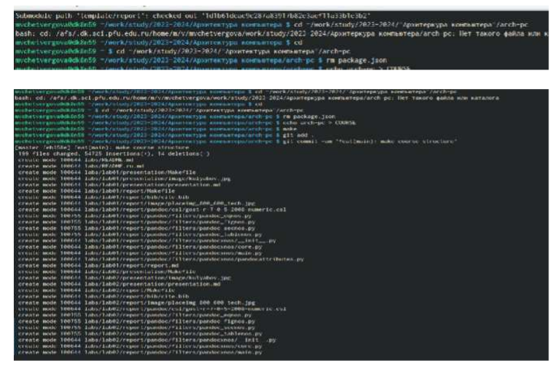

---
## Front matter
title: "ОТЧЕТ
ПО ЛАБОРАТОРНОЙ РАБОТЕ №2"
subtitle: "Дисциплина: Архитектура компьютера"
author: "Студент: Четвергова Мария Викторовна"

## Generic otions
lang: ru-RU
toc-title: "Содержание"

## Bibliography
bibliography: bib/cite.bib
csl: pandoc/csl/gost-r-7-0-5-2008-numeric.csl

## Pdf output format
toc: true # Table of contents
toc-depth: 2
lof: true # List of figures
lot: true # List of tables
fontsize: 12pt
linestretch: 1.5
papersize: a4
documentclass: scrreprt
## I18n polyglossia
polyglossia-lang:
  name: russian
  options:
	- spelling=modern
	- babelshorthands=true
polyglossia-otherlangs:
  name: english
## I18n babel
babel-lang: russian
babel-otherlangs: english
## Fonts
mainfont: PT Serif
romanfont: PT Serif
sansfont: PT Sans
monofont: PT Mono
mainfontoptions: Ligatures=TeX
romanfontoptions: Ligatures=TeX
sansfontoptions: Ligatures=TeX,Scale=MatchLowercase
monofontoptions: Scale=MatchLowercase,Scale=0.9
## Biblatex
biblatex: true
biblio-style: "gost-numeric"
biblatexoptions:
  - parentracker=true
  - backend=biber
  - hyperref=auto
  - language=auto
  - autolang=other*
  - citestyle=gost-numeric
## Pandoc-crossref LaTeX customization
figureTitle: "Рис."
tableTitle: "Таблица"
listingTitle: "Листинг"
lofTitle: "Список иллюстраций"
lotTitle: "Список таблиц"
lolTitle: "Листинги"
## Misc options
indent: true
header-includes:
  - \usepackage{indentfirst}
  - \usepackage{float} # keep figures where there are in the text
  - \floatplacement{figure}{H} # keep figures where there are in the text
---

# Цель работы

Целью работы является изучение идеологии и применение средств контроля версий.
Важной составляющей лабораторной работы № 2 является приобретение практических
навыков по работе с системой git.

# Задание
Приобрести теоретические навыки работы с системой git. Практически закрепить
знания работы и применить на практике полученные знания об идеологии и
применении средств контроля версий. Усвоить знания, приобретѐнные в ходе
выполнения лабораторной работы № 2. И получить необходимые навыки для
работы с системой git.

# Теоретическое введение

Системы контроля версий. Общие понятия Системы контроля версий
(Version Control System, VCS) применяются при работе нескольких человек над
одним проектом. Обычно основное дерево проекта хранится в локальном или
удалѐнном репозитории, к которому настроен доступ для участников проекта. При
внесении изменений в содержание проекта система контроля версий позволяет их
фиксировать, совмещать изменения, произведѐнные разными участниками
проекта, производить откат к любой более ранней версии проекта, если это
требуется. В классических системах контроля версий используется
централизованная модель, предполагающая наличие единого репозитория для
хранения файлов. Выполнение большинства функций по управлению версиями
осуществляется специальным сервером. Участник проекта (пользователь) перед
началом работы посредством определѐнных команд получает нужную ему версию
файлов. После внесения изменений, пользователь размещает новую версию в
хранилище. При этом предыдущие версии не удаляются из центрального
хранилища и к ним можно вернуться в любой момент. Сервер может сохранять не
полную версию изменѐнных файлов, а производить так называемую дельта-
компрессию — сохранять только изменения между последовательными версиями,
что позволяет уменьшить объѐм хранимых данных. Системы контроля версий
поддерживают возможность отслеживания и разрешения конфликтов, которые
могут возникнуть при работе нескольких человек над одним файлом. Можно
объединить (слить) изменения, сделанные разными участниками (автоматически
или вручную), вручную выбрать нужную версию, отменить изменения вовсе или
заблокировать файлы для изменения. В зависимости от настроек блокировка не
позволяет другим пользователям получить рабочую копию или препятствует
изменению рабочей копии файла средствами файловой системы ОС, обеспечивая
таким образом, привилегированный доступ только одному пользователю,
работающему с файлом.
Системы контроля версий также могут обеспечивать дополнительные, более
гибкие функциональные возможности. Например, они могут поддерживать работу
с несколькими версиями одного файла, сохраняя общую историю изменений до
7
точки ветвления версий и собственные истории изменений каждой ветви. Кроме
того, обычно доступна информация о том, кто из участников, когда и какие
изменения вносил. Обычно такого рода информация хранится в журнале
изменений, доступ к которому можно ограничить. В отличие от классических, в
распределѐнных системах контроля версий центральный репозиторий не является
обязательным. Среди классических VCS наиболее известны CVS, Subversion, а
среди распределѐнных — Git, Bazaar, Mercurial. Принципы их работы схожи,
отличаются они в основном синтаксисом используемых в работе команд.
2. Система контроля версий Git
Система контроля версий Git представляет собой набор программ командной
строки. Доступ к ним можно получить из терминала посредством ввода команды
git с различными опциями. Благодаря тому, что Git является распределѐнной
системой контроля версий, резервную копию локального хранилища можно
сделать простым копированием или архивацией.
3.Техническое обеспечение Лабораторная работа подразумевает выполнение
настройки и работы с системой контроля версий Git (https://git-scm.com/).
Выполнение работы возможно как в дисплейном классе факультета физико-
математических и естественных наук РУДН, так и дома. Описание выполнения
работы приведено для дисплейного класса со следующими характеристиками
техники:
– Intel Core i3-550 3.2 GHz, 4 GB оперативной памяти, 8 GB свободного места на
жѐстком диске;
– ОС Linux Gentoo (http://www.gentoo.ru/)

# Выполнение лабораторной работы

##Настройка github
Существует несколько доступных серверов репозиториев с возможностью
бесплатного размещения данных. Например, http://bitbucket.org/, https://github.com/
и https://gitflic.ru. Для выполнения лабораторных работ предлагается использовать
Github. Создадим учѐтную запись на сайте https://github.com/ и заполним
основные данные:
## Базовая настройка git
(рис. @fig:001).
{#fig:001 width=70%} 

Сначала сделаем предварительную конфигурацию git. Откроем терминал и
введѐм следующие команды, указав имя и email владельца репоз

## Создание SSH ключа
Для последующей идентификации пользователя на сервере репозиториев
необходимо сгенерировать пару ключей (приватный и открытый)
Далее необходимо загрузить сгенерѐнный открытый ключ. Для этого зайти на сайт
github под своей учѐтной записью и перейти в меню Setting . После этого выбрать
в боковом меню SSH and GPG keys и нажать кнопку New SSH key . Скопировав из
локальной консоли ключ в буфер вставляем ключ в появившееся на сайте поле и
указываем для ключа имя (Title) (рис. @fig:002).

{#fig:002 width=70%} 

## Сознание рабочего пространства и репозитория курса на основе шаблона
При выполнении лабораторных работ следует придерживаться структуры
рабочего пространства. Название проекта на хостинге git имеет вид:
study_<учебный год>_<код предмета>
Например, для 2023–2024 учебного года и предмета «Архитектура компьютера»
(код предмета arch-pc) название проекта примет следующий вид:
study_2023–2024_arch-pc
Откроем терминал и создадим каталог для предмета «Архитектура компьютера» (рис. @fig:003):

{#fig:003 width=70%} 

## Сознание репозитория курса на основе шаблона
Репозиторий на основе шаблона можно создать через web-интерфейс github.
Перейдѐм на станицу репозитория с шаблоном курса. Далее выбераем Use this
template:

{#fig:004 width=70%} 

{#fig:005 width=70%} 

В открывшемся окне задайте имя репозитория (Repository name) study_2023–
2024_arhpc и создайте репозиторий (кнопка Create repository from template).
Откроем терминал и перейдѐм в каталог курса, клонируем созданный
репозиторий:

:

{#fig:007 width=70%} 

Пояснение: В подкаталоге lab02 каталога labs создаѐм файл report. Данный файл
содержит отчѐт по выполнению лабораторной работы №2. Таким образом отчѐт по
выполнению лабораторной работы хранится в подкаталоге lab02 каталога labs

5.2 Скопируйте отчеты по выполнению предыдущих лабораторных работ в
соответствующие каталоги созданного рабочего пространства.

{#fig:008 width=70%} 

# Выводы
В ходе лабораторной работы №2 мы получили необходимые теоретические знания для
работы с системой git, а также закрепили полученные знания на практике. Изучены
базовые команды для работы с системой git, изучили идеологию и применение средств
контроля версий. Работа выполнена с помощью операционной системы Linux и сайта git
hub. Таким образом получены базовые знания, позволяющие работать с системой git и
средствами контроля версий.

# Список литературы{.unnumbered}

1. GDB: The GNU Project Debugger. — URL: https://www.gnu.org/software/gdb/.
2. GNU Bash Manual. — 2016. — URL: https://www.gnu.org/software/bash/manual/.
3. Midnight Commander Development Center. — 2021. — URL: https://midnight-commander. org/.
4. NASM Assembly Language Tutorials. — 2021. — URL: https://asmtutor.com/.
5. Newham C. Learning the bash Shell: Unix Shell Programming. — O’Reilly Media, 2005. — 354 с. — (In a
Nutshell).
— ISBN
0596009658.
—
URL:
http://www.amazon.com/Learningbash-Shell-Programming-
Nutshell/dp/0596009658.
6. Robbins A. Bash Pocket Reference. — O’Reilly Media, 2016. — 156 с. — ISBN 978-1491941591.
7. The NASM documentation. — 2021. — URL: https://www.nasm.us/docs.php.
8. Zarrelli G. Mastering Bash. — Packt Publishing, 2017. — 502 с. — ISBN 9781784396879.
9. Колдаев В. Д., Лупин С. А. Архитектура ЭВМ. — М. : Форум, 2018.
10. Куляс О. Л., Никитин К. А. Курс программирования на ASSEMBLER. — М. : Солон-Пресс, 2017.
11. Новожилов О. П. Архитектура ЭВМ и систем. — М. : Юрайт, 2016.
12. Расширенный ассемблер: NASM. — 2021. — URL: https://www.opennet.ru/docs/RUS/nasm/.
13. Робачевский А., Немнюгин С., Стесик О. Операционная система UNIX. — 2-е изд. — БХВПетербург — 656 с. — ISBN 978-5-94157-538-1.
14. Столяров А. Программирование на языке ассемблера NASM для ОС Unix. — 2-е изд. — М. : МАКС
Пресс, 2011. — URL: http://www.stolyarov.info/books/asm_unix.
15. Таненбаум Э. Архитектура компьютера. — 6-е изд. — СПб. : Питер, 2013. — 874 с. — (Классика
Computer Science).
16. Таненбаум Э., Бос Х. Современные операционные системы. — 4-е изд. — СПб. : Питер, 2015. — 1120
с. — (Классика Computer Science).

::: {#refs}
:::
