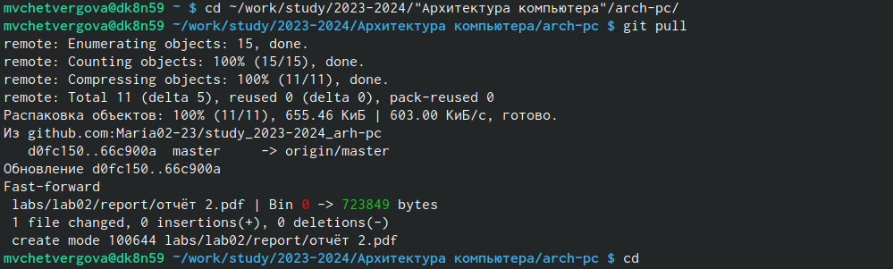
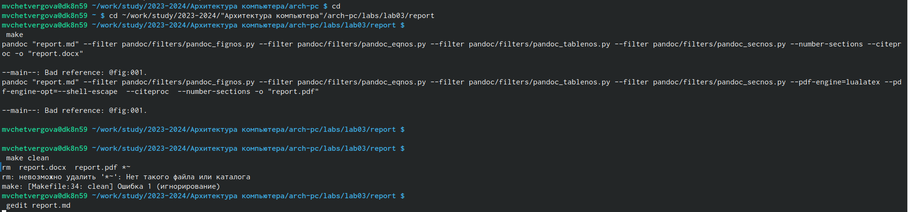
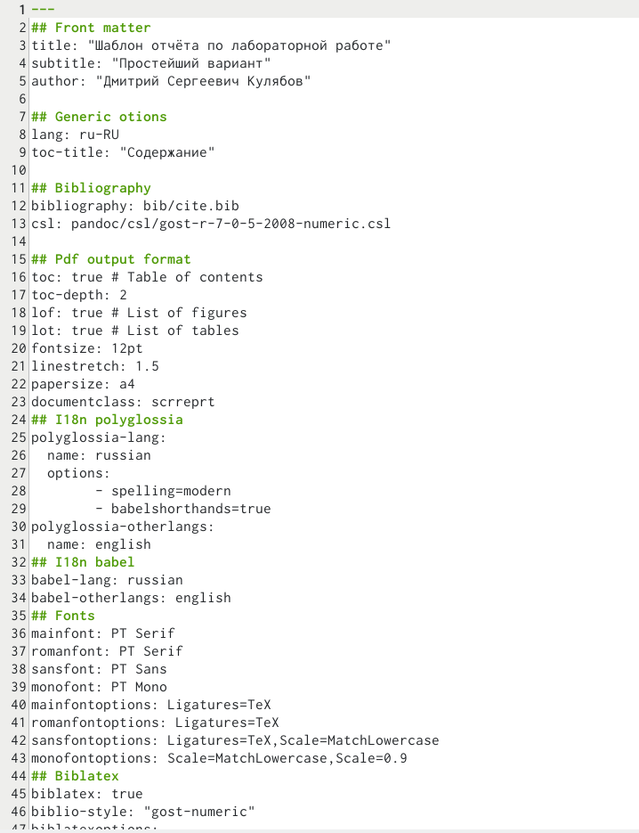
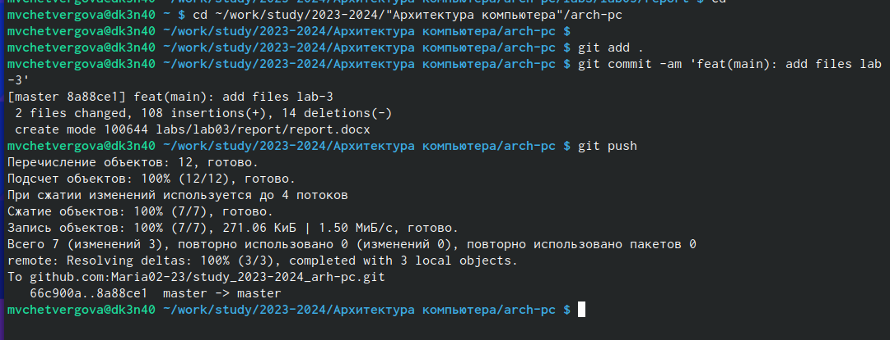
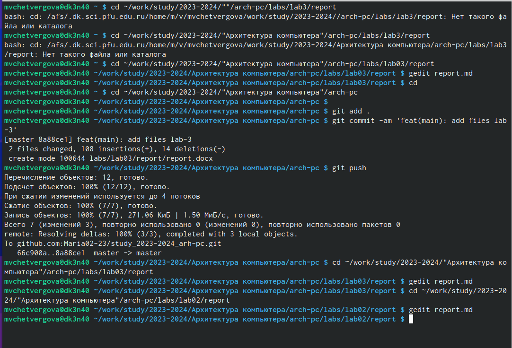
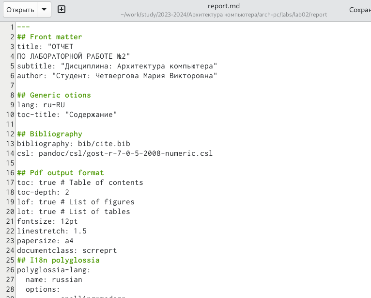

---
## Front matter
title: "отчёт по лабораторной работе 3"
subtitle: "Язык разметки Markdown"
author: "Четвергова Мария Викторовна"

## Generic otions
lang: ru-RU
toc-title: "Содержание"

## Bibliography
bibliography: bib/cite.bib
csl: pandoc/csl/gost-r-7-0-5-2008-numeric.csl

## Pdf output format
toc: true # Table of contents
toc-depth: 2
lof: true # List of figures
lot: true # List of tables
fontsize: 12pt
linestretch: 1.5
papersize: a4
documentclass: scrreprt
## I18n polyglossia
polyglossia-lang:
  name: russian
  options:
	- spelling=modern
	- babelshorthands=true
polyglossia-otherlangs:
  name: english
## I18n babel
babel-lang: russian
babel-otherlangs: english
## Fonts
mainfont: PT Serif
romanfont: PT Serif
sansfont: PT Sans
monofont: PT Mono
mainfontoptions: Ligatures=TeX
romanfontoptions: Ligatures=TeX
sansfontoptions: Ligatures=TeX,Scale=MatchLowercase
monofontoptions: Scale=MatchLowercase,Scale=0.9
## Biblatex
biblatex: true
biblio-style: "gost-numeric"
biblatexoptions:
  - parentracker=true
  - backend=biber
  - hyperref=auto
  - language=auto
  - autolang=other*
  - citestyle=gost-numeric
## Pandoc-crossref LaTeX customization
figureTitle: "Рис."
tableTitle: "Таблица"
listingTitle: "Листинг"
lofTitle: "Список иллюстраций"
lotTitle: "Список таблиц"
lolTitle: "Листинги"
## Misc options
indent: true
header-includes:
  - \usepackage{indentfirst}
  - \usepackage{float} # keep figures where there are in the text
  - \floatplacement{figure}{H} # keep figures where there are in the text
---

# Цель работы

Целью работы является освоение процедуры оформления отчетов с помощью легковесного
языка разметки Markdown.

# Задание

Освоить процедуру оформления отчётов с помощью легковесного языка разметки Makdown. Научиться работать в легковесном языке разметки Makdown и составить отчёт для лаборатрной работы №3.

# Выполнение лабораторной работы

1. Откроем терминал
2. Перейдём в каталог курса, сформированный при выполнении лабораторной работы №2

Обновите локальный репозиторий, скачав изменения из удаленного репозитория с помощью команды
git pull

{#fig:001 width=70%}

3. Перейдем в каталог с шаблоном отчета по лабораторной работе No 3
4. Проведите компиляцию шаблона с использованием Makefile. Для этого введите ко-
манду
make
При успешной компиляции должны сгенерироваться файлы report.pdf и report.docx.
Откроем и проверим корректность полученных файлов.

{#fig:002 width=70%}

5. Удалим полученные файлы с использованием Makefile. Для этого введем команду
make clean

{#fig:003 width=70%}

6. Откройте файл report.md c помощью любого текстового редактора, например gedit
Внимательно изучите структуру этого файла.

{#fig:004 width=70%}

7. Заполните отчет и скомпилируйте отчет с использованием Makefile. Проверьте кор-
ректность полученных файлов. (Обратите внимание, для корректного отображения
скриншотов они должны быть размещены в каталоге image)
8. Загрузите файлы на Github.

{#fig:005 width=70%}

## Задание для самостоятельной работы
1. В соответствующем каталоге сделаем отчёт по лабораторной работе No 2 в формате
Markdown. В качестве отчёта необходимо предоставить отчёты в 3 форматах: pdf, docx
и md.

{#fig:006 width=70%}

2. Загрузите файлы на github.

# Выводы

В ходе выполнения лабораторной работы №3 мы освоили процедуру оформления отчетов с помощью легковесного
языка разметки Markdow и получили необходимые навыки для работы в легковесном языке Markdown.

::: {#refs}
:::
