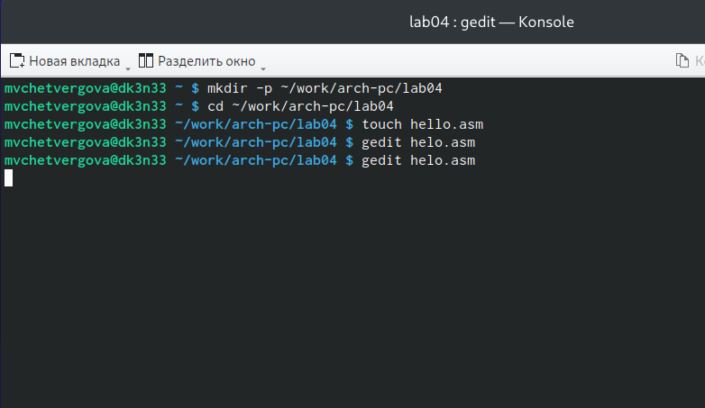

---
## Front matter
title: "Лабораторная работа №4"
subtitle: "Создание и процесс обработки программ на языке ассемблера NASM"
author: "Четвергова Мария Викторовна"

## Generic otions
lang: ru-RU
toc-title: "Содержание"

## Bibliography
bibliography: bib/cite.bib
csl: pandoc/csl/gost-r-7-0-5-2008-numeric.csl

## Pdf output format
toc: true # Table of contents
toc-depth: 2
lof: true # List of figures
lot: true # List of tables
fontsize: 12pt
linestretch: 1.5
papersize: a4
documentclass: scrreprt
## I18n polyglossia
polyglossia-lang:
  name: russian
  options:
	- spelling=modern
	- babelshorthands=true
polyglossia-otherlangs:
  name: english
## I18n babel
babel-lang: russian
babel-otherlangs: english
## Fonts
mainfont: PT Serif
romanfont: PT Serif
sansfont: PT Sans
monofont: PT Mono
mainfontoptions: Ligatures=TeX
romanfontoptions: Ligatures=TeX
sansfontoptions: Ligatures=TeX,Scale=MatchLowercase
monofontoptions: Scale=MatchLowercase,Scale=0.9
## Biblatex
biblatex: true
biblio-style: "gost-numeric"
biblatexoptions:
  - parentracker=true
  - backend=biber
  - hyperref=auto
  - language=auto
  - autolang=other*
  - citestyle=gost-numeric
## Pandoc-crossref LaTeX customization
figureTitle: "Рис."
tableTitle: "Таблица"
listingTitle: "Листинг"
lofTitle: "Список иллюстраций"
lotTitle: "Список таблиц"
lolTitle: "Листинги"
## Misc options
indent: true
header-includes:
  - \usepackage{indentfirst}
  - \usepackage{float} # keep figures where there are in the text
  - \floatplacement{figure}{H} # keep figures where there are in the text
---

# Цель работы

Освоение процедуры компиляции и сборки программ, написанных на ассемблере NASM.

# Теоретическое введение

##Основные принципы работы компьютера
Основными функциональными элементами любой электронно-вычислительной машины
(ЭВМ) являются центральный процессор, память и периферийные устройства.
Взаимодействие этих устройств осуществляется через общую шину, к которой они подклю-
чены. Физически шина представляет собой большое количество проводников, соединяющих
устройства друг с другом. В современных компьютерах проводники выполнены в виде элек-
тропроводящих дорожек на материнской (системной) плате.
Основной задачей процессора является обработка информации, а также организация
координации всех узлов компьютера. В состав центрального процессора (ЦП) входят
следующие устройства:
• арифметико-логическое устройство (АЛУ) — выполняет логические и арифметиче-
ские действия, необходимые для обработки информации, хранящейся в памяти;
• устройство управления (УУ) — обеспечивает управление и контроль всех устройств
компьютера;
• регистры — сверхбыстрая оперативная память небольшого объёма, входящая в со-
став процессора, для временного хранения промежуточных результатов выполнения
инструкций; регистры процессора делятся на два типа: регистры общего назначения и
специальные регистры.
Для того, чтобы писать программы на ассемблере, необходимо знать, какие регистры
процессора существуют и как их можно использовать. Большинство команд в программах
написанных на ассемблере используют регистры в качестве операндов. Практически все
команды представляют собой преобразование данных хранящихся в регистрах процессора,
это например пересылка данных между регистрами или между регистрами и памятью, пре-
образование (арифметические или логические операции) данных хранящихся в регистрах.

Доступ к регистрам осуществляется не по адресам, как к основной памяти, а по именам.
Каждый регистр процессора архитектуры x86 имеет свое название, состоящее из 2 или 3
букв латинского алфавита

Таким образом можно отметить, что вы можете написать в своей программе, например,
такие команды (mov – команда пересылки данных на языке ассемблера):
mov ax, 1
mov eax, 1
Обе команды поместят в регистр AX число 1. Разница будет заключаться только в том, что
вторая команда обнулит старшие разряды регистра EAX, то есть после выполнения второй
команды в регистре EAX будет число 1. А первая команда оставит в старших разрядах регистра
EAX старые данные. И если там были данные, отличные от нуля, то после выполнения первой
команды в регистре EAX будет какое-то число, но не 1. А вот в регистре AX будет число 1.
Другим важным узлом ЭВМ является оперативное запоминающее устройство (ОЗУ).
ОЗУ — это быстродействующее энергозависимое запоминающее устройство, которое на-
прямую взаимодействует с узлами процессора, предназначенное для хранения программ и
данных, с которыми процессор непосредственно работает в текущий момент. ОЗУ состоит из
одинаковых пронумерованных ячеек памяти. Номер ячейки памяти — это адрес хранящихся
в ней данных.

##Ассемблер и язык ассемблера
Язык ассемблера (assembly language, сокращённо asm) — машинно-ориентированный
язык низкого уровня. Можно считать, что он больше любых других языков приближен к
архитектуре ЭВМ и её аппаратным возможностям, что позволяет получить к ним более
полный доступ, нежели в языках высокого уровня, таких как C/C++, Perl, Python и пр. Заметим,
что получить полный доступ к ресурсам компьютера в современных архитектурах нельзя,
самым низким уровнем работы прикладной программы является обращение напрямую к
ядру операционной системы. Именно на этом уровне и работают программы, написанные
на ассемблере. Но в отличие от языков высокого уровня ассемблерная программа содержит
только тот код, который ввёл программист. Таким образом язык ассемблера — это язык, с
помощью которого понятным для человека образом пишутся команды для процессора.
Следует отметить, что процессор понимает не команды ассемблера, а последовательности
из нулей и единиц — машинные коды. До появления языков ассемблера программистам
приходилось писать программы, используя только лишь машинные коды, которые были
крайне сложны для запоминания, так как представляли собой числа, записанные в двоичной
или шестнадцатеричной системе счисления. Преобразование или трансляция команд с
языка ассемблера в исполняемый машинный код осуществляется специальной программой
транслятором — Ассемблер.
Программы, написанные на языке ассемблера, не уступают в качестве и скорости програм-
мам, написанным на машинном языке, так как транслятор просто переводит мнемонические
обозначения команд в последовательности бит (нулей и единиц).
Используемые мнемоники обычно одинаковы для всех процессоров одной архитектуры
или семейства архитектур (среди широко известных — мнемоники процессоров и контрол-
леров x86, ARM, SPARC, PowerPC,M68k). Таким образом для каждой архитектуры существует
свой ассемблер и, соответственно, свой язык ассемблера.

# Выполнение лабораторной работы

##Программа Hello world!
Рассмотрим пример простой программы на языке ассемблера NASM. Традиционно первая
программа выводит приветственное сообщение Hello world! на экран.
Создайте каталог для работы с программами на языке ассемблера NASM
Перейдите в созданный каталог и создайте текстовый файл с именем hello.asm
touch hello.asm
откройте этот файл с помощью любого текстового редактора, например, gedit
gedit hello.asm
и введите в него следующий текст:

{#fig:001 width=70%}

{#fig:002 width=70%}

В отличие от многих современных высокоуровневых языков программирования, в ас-
семблерной программе каждая команда располагается на отдельной строке. Размещение
нескольких команд на одной строке недопустимо. Синтаксис ассемблера NASM является
чувствительным к регистру, т.е. есть разница между большими и малыми буквами.

##Транслятор NASM

NASM превращает текст программы в объектный код. Например, для компиляции приве-
дённого выше текста программы «Hello World» необходимо написать:

{#fig:003 width=70%}

Если текст программы набран без ошибок, то транслятор преобразует текст программы
из файла hello.asm в объектный код, который запишется в файл hello.o. Таким образом,
имена всех файлов получаются из имени входного файла и расширения по умолчанию.
При наличии ошибок объектный файл не создаётся, а после запуска транслятора появятся
сообщения об ошибках или предупреждения.
С помощью команды ls проверьте, что объектный файл был создан. Какое имя имеет
объектный файл.
NASM не запускают без параметров. Ключ -f указывает транслятору, что требуется создать
бинарные файлы в формате ELF. Следует отметить, что формат elf64 позволяет создавать
исполняемый код, работающий под 64-битными версиями Linux. Для 32-битных версий ОС
указываем в качестве формата просто elf.
NASM всегда создаёт выходные файлы в текущем каталоге.

##Расширенный синтаксис командной строки NASM

Выполним следующую команду:

{#fig:004 width=70%}

Данная команда скомпилирует исходный файл hello.asm в obj.o (опция -o позволяет
задать имя объектного файла, в данном случае obj.o), при этом формат выходного файла
будет elf, и в него будут включены символы для отладки (опция -g), кроме того, будет создан
файл листинга list.lst (опция -l).
С помощью команды ls проверьте, что файлы были созданы.
Для более подробной информации см. man nasm. Для получения списка форматов объект-
ного файла см. nasm -hf.

## Компоновщик LD

чтобы получить исполняемую программу, объектный файл
необходимо передать на обработку компоновщику:

{#fig:005 width=70%}

С помощью команды ls проверьте, что исполняемый файл hello был создан.
Компоновщик ld не предполагает по умолчанию расширений для файлов, но принято
использовать следующие расширения:
• o – для объектных файлов;
• без расширения – для исполняемых файлов;
• map – для файлов схемы программы;
• lib – для библиотек.
Ключ -o с последующим значением задаёт в данном случае имя создаваемого исполняе-
мого файла.
Выполните следующую команду:

{#fig:006 width=70%}

Какое имя будет иметь исполняемый файл? Какое имя имеет объектный файл из которого
собран этот исполняемый файл?
Формат командной строки LD можно увидеть, набрав ld --help. Для получения более
подробной информации.

## Запуск исполняемого файла

Запустить на выполнение созданный исполняемый файл, находящийся в текущем каталоге,
можно, набрав в командной строке:

{#fig:007 width=70%}

## Самостоятельная работа

1. В каталоге ~/work/arch-pc/lab04 с помощью команды cp создайте копию файла
hello.asm с именем lab4.asm

{#fig:008 width=70%}

2. С помощью любого текстового редактора внесите изменения в текст программы в
файле lab4.asm так, чтобы вместо Hello world! на экран выводилась строка с вашими
фамилией и именем.

{#fig:009 width=70%}

{#fig:010 width=70%}

3. Оттранслируйте полученный текст программы lab4.asm в объектный файл. Выполните
компоновку объектного файла и запустите получившийся исполняемый файл.

{#fig:0011 width=70%}

4. Скопируйте файлы hello.asm и lab4.asm в Ваш локальный репозиторий в ката-
лог ~/work/study/2023-2024/"Архитектура компьютера"/arch-pc/labs/lab04/.
Загрузите файлы на Github

{#fig:012 width=70%}

# Выводы

В ходе выполнения лабораторной работы №4 мы освоили процедуры компиляции и сборки программ, написанных на ассемблере NASM.

::: {#refs}
:::
