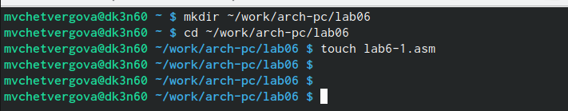
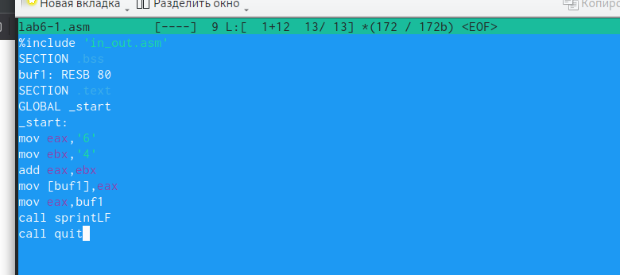
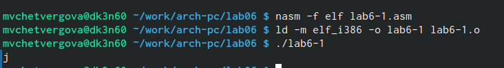
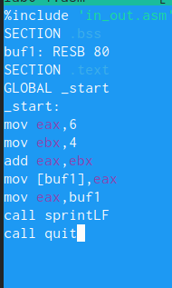
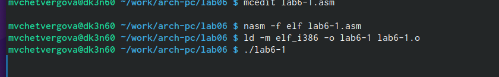
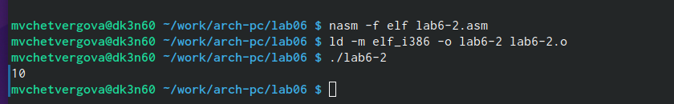
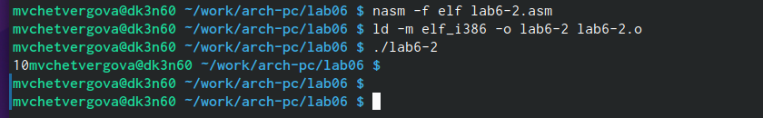
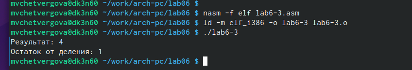
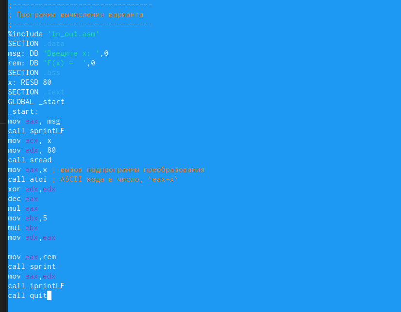
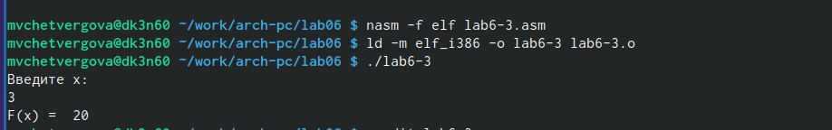

---
## Front matter
title: "Лабораторная работа No6."
subtitle: "Арифметические операции в NASM"
author: "Четвергова Мария Викторовна"

## Generic otions
lang: ru-RU
toc-title: "Содержание"

## Bibliography
bibliography: bib/cite.bib
csl: pandoc/csl/gost-r-7-0-5-2008-numeric.csl

## Pdf output format
toc: true # Table of contents
toc-depth: 2
lof: true # List of figures
lot: true # List of tables
fontsize: 12pt
linestretch: 1.5
papersize: a4
documentclass: scrreprt
## I18n polyglossia
polyglossia-lang:
  name: russian
  options:
	- spelling=modern
	- babelshorthands=true
polyglossia-otherlangs:
  name: english
## I18n babel
babel-lang: russian
babel-otherlangs: english
## Fonts
mainfont: PT Serif
romanfont: PT Serif
sansfont: PT Sans
monofont: PT Mono
mainfontoptions: Ligatures=TeX
romanfontoptions: Ligatures=TeX
sansfontoptions: Ligatures=TeX,Scale=MatchLowercase
monofontoptions: Scale=MatchLowercase,Scale=0.9
## Biblatex
biblatex: true
biblio-style: "gost-numeric"
biblatexoptions:
  - parentracker=true
  - backend=biber
  - hyperref=auto
  - language=auto
  - autolang=other*
  - citestyle=gost-numeric
## Pandoc-crossref LaTeX customization
figureTitle: "Рис."
tableTitle: "Таблица"
listingTitle: "Листинг"
lofTitle: "Список иллюстраций"
lotTitle: "Список таблиц"
lolTitle: "Листинги"
## Misc options
indent: true
header-includes:
  - \usepackage{indentfirst}
  - \usepackage{float} # keep figures where there are in the text
  - \floatplacement{figure}{H} # keep figures where there are in the text
---

# Цель работы

Освоение арифметических инструкций языка ассемблера NASM

# Теоретическое введение

Большинство инструкций на языке ассемблера требуют обработки операндов. Адрес опе-
ранда предоставляет место, где хранятся данные, подлежащие обработке. Это могут быть
данные хранящиеся в регистре или в ячейке памяти. Далее рассмотрены все существующие
способы задания адреса хранения операндов – способы адресации.
Существует три основных способа адресации:
• Регистровая адресация – операнды хранятся в регистрах и в команде используются
имена этих регистров, например: mov ax,bx.
• Непосредственная адресация – значение операнда задается непосредственно в ко-
манде, Например: mov ax,2.
• Адресация памяти – операнд задает адрес в памяти. В команде указывается символи-
ческое обозначение ячейки памяти, над содержимым которой требуется выполнить
операцию.
Например, определим переменную intg DD 3 – это означает, что задается область памяти
размером 4 байта, адрес которой обозначен меткой intg. 

В этом случае в регистр eax запишется адрес intg. Допустим, для intg выделена память
начиная с ячейки с адресом 0x600144, тогда команда mov eax,intg аналогична команде mov
eax,0x600144 – т.е. эта команда запишет в регистр eax число 0x600144.
Схема команды целочисленного сложения add (от англ. addition - добавление) выполняет
сложение двух операндов и записывает результат по адресу первого операнда. 

Команда целочисленного вычитания sub (от англ. subtraction – вычитание) работает анало-
гично команде add и выглядит следующим образом

Довольно часто при написании программ встречается операция прибавления или вычита-
ния единицы. Прибавление единицы называется инкрементом, а вычитание — декрементом.
Для этих операций существуют специальные команды: inc (от англ. increment) и dec (от англ.
decrement), которые увеличивают и уменьшают на 1 свой операнд.
Эти команды содержат один операнд и имеет следующий вид.
Операндом может быть регистр или ячейка памяти любого размера. Команды инкремента
и декремента выгодны тем, что они занимают меньше места, чем соответствующие команды
сложения и вычитания.
Так, например, команда inc ebx увеличивает значение регистра ebx на 1, а команда inc
ax уменьшает значение регистра ax на 1

Для команд умножения один из сомножителей указывается в команде и должен нахо-
диться в регистре или в памяти, но не может быть непосредственным операндом. Второй
сомножитель в команде явно не указывается и должен находиться в регистре EAX,AX или
AL, а результат помещается в регистры EDX:EAX, DX:AX или AX, в зависимости от размер.

В командах указывается только один операнд – делитель, который может быть регистром
или ячейкой памяти, но не может быть непосредственным операндом. Местоположение
делимого и результата для команд деления зависит от размера делителя. Кроме того, так как
в результате деления получается два числа – частное и остаток, то эти числа помещаются в
определённые регистры 

Ввод информации с клавиатуры и вывод её на экран осуществляется в символьном виде.
Кодирование этой информации производится согласно кодовой таблице символов ASCII.
ASCII – сокращение от American Standard Code for Information Interchange (Американский
стандартный код для обмена информацией). Согласно стандарту ASCII каждый символ
кодируется одним байтом.
Расширенная таблица ASCII состоит из двух частей. Первая (символы с кодами 0-127)
является универсальной (см. Приложение.), а вторая (коды 128-255) предназначена для
специальных символов и букв национальных алфавитов и на компьютерах разных типов
может меняться.
Среди инструкций NASM нет такой, которая выводит числа (не в символьном виде). По-
этому, например, чтобы вывести число, надо предварительно преобразовать его цифры в
ASCII-коды этих цифр и выводить на экран эти коды, а не само число. Если же выводить число
на экран непосредственно, то экран воспримет его не как число, а как последовательность
ASCII-символов – каждый байт числа будет воспринят как один ASCII-символ – и выведет на
экран эти символы.
Аналогичная ситуация происходит и при вводе данных с клавиатуры. Введенные дан-
ные будут представлять собой символы, что сделает невозможным получение корректного
результата при выполнении над ними арифметических операций.
Для решения этой проблемы необходимо проводить преобразование ASCII символов в
числа и обратно.
Для выполнения лабораторных работ в файле in_out.asm реализованы подпрограммы
для преобразования ASCII символов в числа и обратно. Это:
• iprint – вывод на экран чисел в формате ASCII, перед вызовом iprint в регистр eax
необходимо записать выводимое число (mov eax,<int>).
• iprintLF – работает аналогично iprint, но при выводе на экран после числа добавляет
к символ перевода строки.
• atoi – функция преобразует ascii-код символа в целое число и записает результат
в регистр eax, перед вызовом atoi в регистр eax необходимо записать число (mov
eax.

# Выполнение лабораторной работы

1. Создайте каталог для программам лабораторной работы No 6, перейдите в него и
создайте файл lab6-1.asm:

{#fig:001 width=70%}

2. Рассмотрим примеры программ вывода символьных и численных значений. Програм-
мы будут выводить значения записанные в регистр eax.

Введём в файл lab6-1.asm текст программы из листинга 6.1. В данной программе в ре-
гистр eax записывается символ 6 (mov eax,'6'), в регистр ebx символ 4 (mov ebx,'4').
Далее к значению в регистре eax прибавляем значение регистра ebx (add eax,ebx, ре-
зультат сложения запишется в регистр eax). Далее выводим результат. 

{#fig:002 width=70%}

В данном случае при выводе значения регистра eax мы ожидаем увидеть число 10. Однако
результатом будет символ j. Это происходит потому, что код символа 6 равен 00110110 в
двоичном представлении (или 54 в десятичном представлении), а код символа 4 – 00110100 (52). Команда add eax,ebx запишет в регистр eax сумму кодов – 01101010 (106), что в свою
очередь является кодом символа j (см. таблицу ASCII в приложении)

{#fig:003 width=70%}

3. Далее изменим текст программы и вместо символов, запишем в регистры числа. Ис-
правьте текст программы (Листинг 6.1) следующим образом: замените строки

mov eax,'6'
mov ebx,'4'
на строки
mov eax,6
mov ebx,4
Создайте исполняемый файл и запустите его.
Как и в предыдущем случае при исполнении программы мы не получим число 10. В данном
случае выводится символ с кодом 10. Пользуясь таблицей ASCII определите какому символу
соответствует код 10.

{#fig:004 width=70%}

4. Как отмечалось выше, для работы с числами в файле in_out.asm реализованы подпро-
граммы для преобразования ASCII символов в числа и обратно. Преобразуем текст
программы из Листинга 6.1 с использованием этих функций.
Создайте файл lab6-2.asm в каталоге ~/work/arch-pc/lab06 и введите в него текст про-
граммы из листинга 6.2.

{#fig:005 width=70%} 

В результате работы программы мы получим число 106. В данном случае, как и в первом,
команда add складывает коды символов ‘6’ и ‘4’ (54+52=106). Однако, в отличии от программы
из листинга 6.1, функция iprintLF позволяет вывести число, а не символ, кодом которого
является это число.

5. Аналогично предыдущему примеру изменим символы на числа. Замените строки
mov eax,'6'
mov ebx,'4'
на строки
mov eax,6
mov ebx,4
Создайте исполняемый файл и запустите его. Какой результат будет получен при исполне-
нии программы?
Замените функцию iprintLF на iprint. Создайте исполняемый файл и запустите его.

{#fig:006 width=70%}

6. В качестве примера выполнения арифметических операций в NASM приведем про-
грамму вычисления арифметического выражения 𝑓(𝑥) = (5 ∗ 2 + 3)/3.
Создайте файл lab6-3.asm в каталоге ~/work/arch-pc/lab06:
touch ~/work/arch-pc/lab06/lab6-3.asm
Внимательно изучите текст программы из листинга 6.3 и введите в lab6-3.asm.

Создайте исполняемый файл и запустите его. Результат работы программы должен быть
следующим

{#fig:007 width=70%}

{#fig:008 width=70%}

{#fig:007 width=70%}

{#fig:007 width=70%}

7. В качестве другого примера рассмотрим программу вычисления варианта задания по
номеру студенческого билета, работающую по следующему алгоритму

В данном случае число, над которым необходимо проводить арифметические операции,
вводится с клавиатуры. Как отмечалось выше ввод с клавиатуры осуществляется в символь-
ном виде и для корректной работы арифметических операций в NASM символы необхо-
димо преобразовать в числа. Для этого может быть использована функция atoi из файла
in_out.asm.
Создайте файл variant.asm в каталоге ~/work/arch-pc/lab06:

{#fig:008 width=70%}

#Задание для самостоятельной работы

Написать программу вычисления выражения 𝑦 = 𝑓(𝑥). Программа должна выводить
выражение для вычисления, выводить запрос на ввод значения 𝑥, вычислять задан-
ное выражение в зависимости от введенного 𝑥, выводить результат вычислений. Вид
функции 𝑓(𝑥) выбрать из таблицы 6.3 вариантов заданий в соответствии с номером
полученным при выполнении лабораторной работы. Создайте исполняемый файл и
проверьте его работу для значений 𝑥1 и 𝑥2.

{#fig:009 width=70%}

{#fig:010 width=70%}

# Выводы

В ходе выполнения лабораторной работы №6 мы освоили арифметических инструкций языкаассемблера NASN. Научились применять полученные знания на практике и обучились новым навыкам работы с ЭВМ. 

::: {#refs}
:::
