---
## Front matter
title: "Отчёта по лабораторной работе №7"
subtitle: "Команды безусловного и условного переходов в Nasm. Программирование ветвлений"
author: "Четвергова Мария Викторовна"

## Generic otions
lang: ru-RU
toc-title: "Содержание"

## Bibliography
bibliography: bib/cite.bib
csl: pandoc/csl/gost-r-7-0-5-2008-numeric.csl

## Pdf output format
toc: true # Table of contents
toc-depth: 2
lof: true # List of figures
lot: true # List of tables
fontsize: 12pt
linestretch: 1.5
papersize: a4
documentclass: scrreprt
## I18n polyglossia
polyglossia-lang:
  name: russian
  options:
	- spelling=modern
	- babelshorthands=true
polyglossia-otherlangs:
  name: english
## I18n babel
babel-lang: russian
babel-otherlangs: english
## Fonts
mainfont: PT Serif
romanfont: PT Serif
sansfont: PT Sans
monofont: PT Mono
mainfontoptions: Ligatures=TeX
romanfontoptions: Ligatures=TeX
sansfontoptions: Ligatures=TeX,Scale=MatchLowercase
monofontoptions: Scale=MatchLowercase,Scale=0.9
## Biblatex
biblatex: true
biblio-style: "gost-numeric"
biblatexoptions:
  - parentracker=true
  - backend=biber
  - hyperref=auto
  - language=auto
  - autolang=other*
  - citestyle=gost-numeric
## Pandoc-crossref LaTeX customization
figureTitle: "Рис."
tableTitle: "Таблица"
listingTitle: "Листинг"
lofTitle: "Список иллюстраций"
lotTitle: "Список таблиц"
lolTitle: "Листинги"
## Misc options
indent: true
header-includes:
  - \usepackage{indentfirst}
  - \usepackage{float} # keep figures where there are in the text
  - \floatplacement{figure}{H} # keep figures where there are in the text
---

# Цель работы

Изучение команд условного и безусловного переходов. Приобретение навыков написания программ с использованием переходов. Знакомство с назначением и структурой файла листинга.

# Теоретическое введение

Для реализации ветвлений в ассемблере используются так называемые команды передачи управления или команды перехода. Можно выделить 2 типа переходов:

• условный переход – выполнение или не выполнение перехода в определенную точку программы в зависимости от проверки условия.
• безусловный переход – выполнение передачи управления в определенную точку программы без каких-либо условий.

##Команды безусловного перехода

Безусловный переход выполняется инструкцией jmp (от англ. jump – прыжок), которая
включает в себя адрес перехода, куда следует передать управление:

jmp <адрес_перехода>

Адрес перехода может быть либо меткой, либо адресом области памяти, в которую предварительно помещен указатель перехода. Кроме того, в качестве операнда можно использовать имя регистра, в таком случае переход будет осуществляться по адресу, хранящемуся в этом регистре.

Как отмечалось выше, для условного перехода необходима проверка какого-либо условия. В ассемблере команды условного перехода вычисляют условие перехода анализируя флаги
из регистра флагов.

Флаг – это бит, принимающий значение 1 («флаг установлен»), если выполнено некоторое условие, и значение 0 («флаг сброшен») в противном случае. Флаги работают независимо
друг от друга, и лишь для удобства они помещены в единый регистр — регистр флагов, отражающий текущее состояние процессора. 

Флаги состояния (биты 0, 2, 4, 6, 7 и 11) отражают результат выполнения арифметических
инструкций, таких как ADD, SUB, MUL, DIV.

Инструкция cmp является одной из инструкций, которая позволяет сравнить операнды и
выставляет флаги в зависимости от результата сравнения.
Инструкция cmp является командой сравнения двух операндов и имеет такой же формат,
как и команда вычитания:
cmp <операнд_1>, <операнд_2>
Команда cmp, так же как и команда вычитания, выполняет вычитание <операнд_2> -
<операнд_1>, но результат вычитания никуда не записывается и единственным результатом
команды сравнения является формирование флагов

Команда условного перехода имеет вид:

j<мнемоника перехода> label
Мнемоника перехода связана со значением анализируемых флагов или со способом фор-
мирования этих флагов.
Представлены команды условного перехода, которые обычно ставятся после
команды сравнения cmp. В их мнемокодах указывается тот результат сравнения, при котором
надо делать переход. Мнемоники, идентичные по своему действию, написаны в таблице
через дробь (например, ja и jnbe). Программист выбирает, какую из них применить, чтобы
получить более простой для понимания текст программы.

Примечание: термины «выше» («a» от англ. «above») и «ниже» («b» от англ. «below») при-
менимы для сравнения беззнаковых величин (адресов), а термины «больше» («g» от англ.
«greater») и «меньше» («l» от англ. «lower») используются при учёте знака числа. Таким обра-
зом, мнемонику инструкции JA/JNBE можно расшифровать как «jump if above (переход если
выше) / jump if not below equal (переход если не меньше или равно)».
Помимо перечисленных команд условного перехода существуют те, которые которые
можно использовать после любых команд, меняющих значения флагов 

Листинг (в рамках понятийного аппарата NASM) — это один из выходных файлов, созда-
ваемых транслятором. Он имеет текстовый вид и нужен при отладке программы, так как
кроме строк самой программы он содержит дополнительную информацию.
Ниже приведён фрагмент файла листинга.

Все ошибки и предупреждения, обнаруженные при ассемблировании, транслятор выводит
на экран, и файл листинга не создаётся.
Итак, структура листинга:
• номер строки — это номер строки файла листинга (нужно помнить, что номер строки в
файле листинга может не соответствовать номеру строки в файле с исходным текстом
программы);
• адрес — это смещение машинного кода от начала текущего сегмента;
• машинный код представляет собой ассемблированную исходную строку в виде шестна-
дцатеричной последовательности. (например, инструкция int 80h начинается по сме-
щению 00000020 в сегменте кода; далее идёт машинный код, в который ассемблируется
инструкция, то есть инструкция int 80h ассемблируется в CD80 (в шестнадцатеричном
представлении); CD80 — это инструкция на машинном языке, вызывающая прерывание
ядра)

Исходный текст программы — это просто строка исходной программы вместе с ком-
ментариями (некоторые строки на языке ассемблера, например, строки, содержащие
только комментарии, не генерируют никакого машинного кода, и поля «смещение» и
«исходный текст программы» в таких строках отсутствуют, однако номер строки им
присваивается)

# Выполнение лабораторной работы

Создайте каталог для программам лабораторной работы No 7, перейдите в него и со-
здайте файл lab7-1.asm:

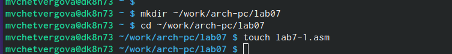{#fig:001 width=70%}

2. Инструкция jmp в NASM используется для реализации безусловных переходов. Рассмот-
рим пример программы с использованием инструкции jmp. Введите в файл lab7-1.asm
текст программы из листинга 7.1.

Листинг 7.1. Программа с использованием инструкции jmp

%include 'in_out.asm' ; подключение внешнего файла
SECTION .data
msg1: DB 'Сообщение No 1',0
msg2: DB 'Сообщение No 2',0
msg3: DB 'Сообщение No 3',0
SECTION .text
GLOBAL _start
_start:
jmp _label2
_label1:
mov eax, msg1 ; Вывод на экран строки
call sprintLF ; 'Сообщение No 1'
_label2:
mov eax, msg2 ; Вывод на экран строки
call sprintLF ; 'Сообщение No 2'
_label3:
mov eax, msg3 ; Вывод на экран строки
call sprintLF ; 'Сообщение No 3'
_end:
call quit ; вызов подпрограммы завершения

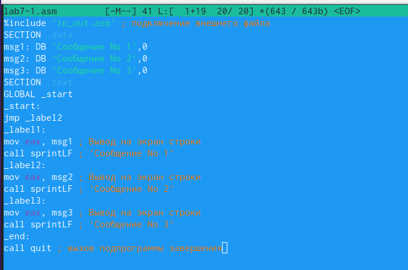{#fig:002 width=70%}

Создайте исполняемый файл и запустите его. Результат работы данной программы будет
следующим:

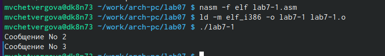{#fig:003 width=70%}

Таким образом, использование инструкции jmp _label2 меняет порядок исполнения
инструкций и позволяет выполнить инструкции начиная с метки _label2, пропустив вывод
первого сообщения.

Инструкция jmp позволяет осуществлять переходы не только вперед но и назад. Изменим
программу таким образом, чтобы она выводила сначала ‘Сообщение No 2’, потом ‘Сообщение
No 1’ и завершала работу. Для этого в текст программы после вывода сообщения No 2 добавим
инструкцию jmp с меткой _label1 (т.е. переход к инструкциям вывода сообщения No 1)
и после вывода сообщения No 1 добавим инструкцию jmp с меткой _end (т.е. переход к
инструкции call quit). Измените текст программы в соответствии с листингом 7.2

Листинг 7.2. Программа с использованием инструкции jmp

%include 'in_out.asm' ; подключение внешнего файла
SECTION .data
msg1: DB 'Сообщение No 1',0
msg2: DB 'Сообщение No 2',0
msg3: DB 'Сообщение No 3',0
SECTION .text
GLOBAL _start
_start:
jmp _label2
_label1:
mov eax, msg1 ; Вывод на экран строки
call sprintLF ; 'Сообщение No 1'
jmp _end
_label2:
mov eax, msg2 ; Вывод на экран строки
call sprintLF ; 'Сообщение No 2'
jmp _label1
_label3:
mov eax, msg3 ; Вывод на экран строки
call sprintLF ; 'Сообщение No 3'
_end:
call quit ; вызов подпрограммы завершения

Создадим исполняемый файл и проверим его работу.

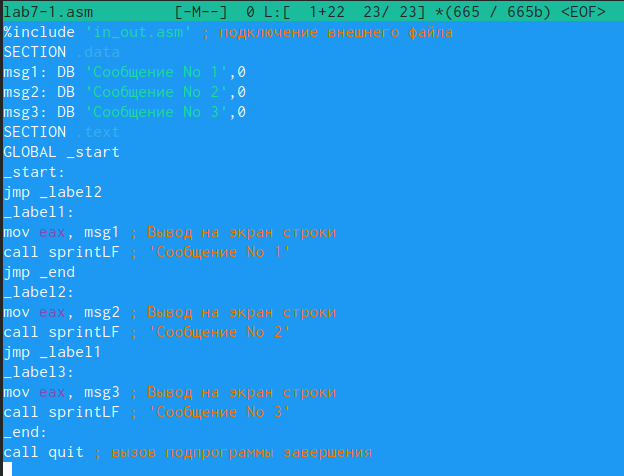{#fig:004 width=70%}

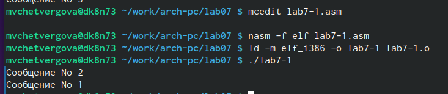{#fig:005 width=70%}

Изменим текст программы добавив или изменив инструкции jmp, чтобы вывод програм-
мы был следующим.

 Использование инструкции jmp приводит к переходу в любом случае. Однако, часто при
написании программ необходимо использовать условные переходы, т.е. переход дол-
жен происходить если выполнено какое-либо условие. В качестве примера рассмотрим
программу, которая определяет и выводит на экран наибольшую из 3 целочисленных
переменных: A,B и C. Значения для A и C задаются в программе, значение B вводиться с
клавиатуры

Создайте файл lab7-2.asm в каталоге ~/work/arch-pc/lab07. Внимательно изучите текст
программы из листинга 7.3 и введите в lab7-2.asm.

Листинг 7.3. Программа, которая определяет и выводит на экран наибольшую из 3
целочисленных переменных: A,B и C.
%include 'in_out.asm'
section .data
msg1 db 'Введите B: ',0h
msg2 db "Наибольшее число: ",0h
A dd '20'
C dd '50'
section .bss
max resb 10
B resb 10
section .text
global _start
_start:
; ---------- Вывод сообщения 'Введите B: '
mov eax,msg1
call sprint
; ---------- Ввод 'B'
mov ecx,B
mov edx,10
call sread
; ---------- Преобразование 'B' из символа в число
mov eax,B
call atoi ; Вызов подпрограммы перевода символа в число
mov [B],eax ; запись преобразованного числа в 'B'
; ---------- Записываем 'A' в переменную 'max'
mov ecx,[A] ; 'ecx = A'
mov [max],ecx ; 'max = A'
; ---------- Сравниваем 'A' и 'С' (как символы)
cmp ecx,[C] ; Сравниваем 'A' и 'С'
jg check_B ; если 'A>C', то переход на метку 'check_B',
mov ecx,[C] ; иначе 'ecx = C'
mov [max],ecx ; 'max = C'
; ---------- Преобразование 'max(A,C)' из символа в число
check_B:
mov eax,max
call atoi ; Вызов подпрограммы перевода символа в число
mov [max],eax ; запись преобразованного числа в `max`
; ---------- Сравниваем 'max(A,C)' и 'B' (как числа)
mov ecx,[max]
cmp ecx,[B] ; Сравниваем 'max(A,C)' и 'B'
jg fin ; если 'max(A,C)>B', то переход на 'fin',
mov ecx,[B] ; иначе 'ecx = B'
mov [max],ecx
; ---------- Вывод результата
fin:
mov eax, msg2
call sprint ; Вывод сообщения 'Наибольшее число: '
mov eax,[max]
call iprintLF ; Вывод 'max(A,B,C)'
call quit ; Выход

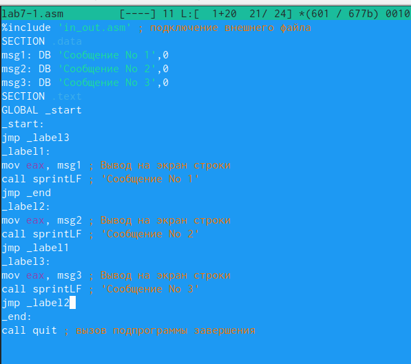{#fig:006 width=70%}

{#fig:007 width=70%}

Создайте исполняемый файл и проверьте его работу для разных значений B.
Обратите внимание, в данном примере переменные A и С сравниваются как символы, а переменная B и максимум из A и С как числа (для этого используется функция atoi преобразования символа в число). Это сделано для демонстрации того, как сравниваются данные.Данную программу можно упростить и сравнивать все 3 переменные как символы (т.е. не использовать функцию atoi). Однако если переменные преобразовать из символов числа, над ними можно корректно проводить арифметические операции.

##Изучение структуры файлы листинга
Обычно nasm создаёт в результате ассемблирования только объектный файл. Получить
файл листинга можно, указав ключ -l и задав имя файла листинга в командной строке.
Создадим файл листинга для программы из файла lab7-2.asm

Откроем файл листинга lab7-2.lst с помощью любого текстового редактора, например mcedit:

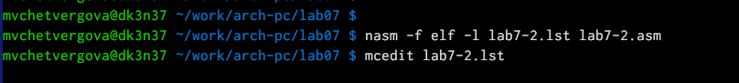{#fig:008 width=70%}

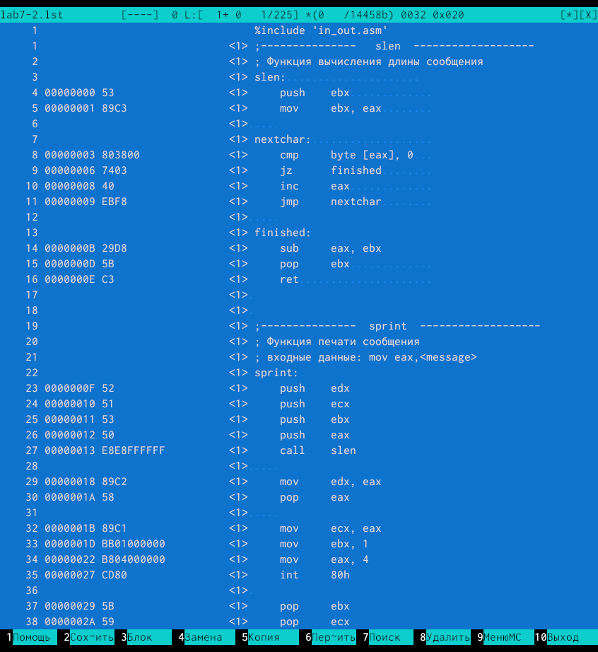{#fig:009 width=70%}

Внимательно ознакомимся с его форматом и содержимым.
Откроем файл с программой lab7-2.asm и в любой инструкции с двумя операндами
удалить один операнд. Выполните трансляцию с получением файла листинга:

{#fig:010 width=70%}

Какие выходные файлы создаются в этом случае? Что добавляется в листинге?
Ответ: В листинг добавляются строки в первой части кода. Отображаются не только номер строки и исходный текст программы, но и адрес и машинный код. Таким образом, листинг - это выходной файл текстового типа, имеющий помимо самой программы дополнительную информацию. Адрес - это смещение машинного кода от начала текущего сегмента, а машинный код - это ассемблированную исходную строку в виде шестна-
дцатеричной последовательности. (например, инструкция int 80h начинается по сме-
щению 00000020 в сегменте кода)

##Задание для самостоятельной работы
1. Напишите программу нахождения наименьшей из 3 целочисленных переменных 𝑎,𝑏 и .
Значения переменных выбрать из табл. 7.5 в соответствии с вариантом, полученным
при выполнении лабораторной работы No 7. Создайте исполняемый файл и проверьте
его работу.

Вариант 7:

Листинг данной программы:

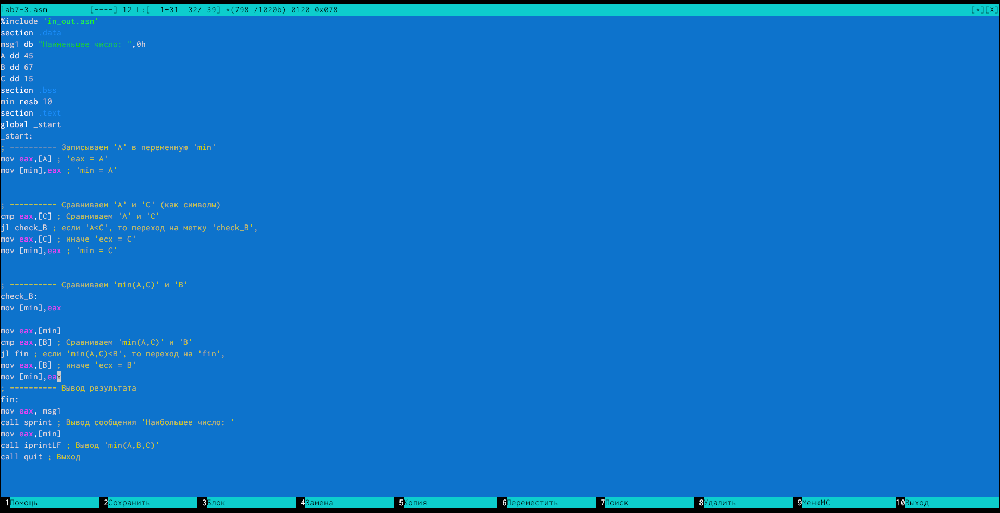{#fig:011 width=70%}

Результат выполнения данной программы:
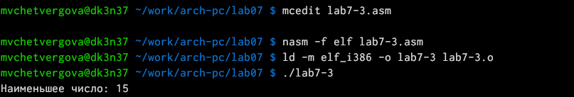{#fig:012 width=70%}

2. Напишите программу, которая для введенных с клавиатуры значений 𝑥 и 𝑎 вычисляет
значение заданной функции 𝑓(𝑥) и выводит результат вычислений. Вид функции 𝑓(𝑥)
выбрать из таблицы вариантов заданий в соответствии с вариантом, полученным
при выполнении лабораторной работы No 7. Создайте исполняемый файл и проверьте
его работу для значений 𝑥 и 𝑎.

Вариант 7:

Листинг данной программы:

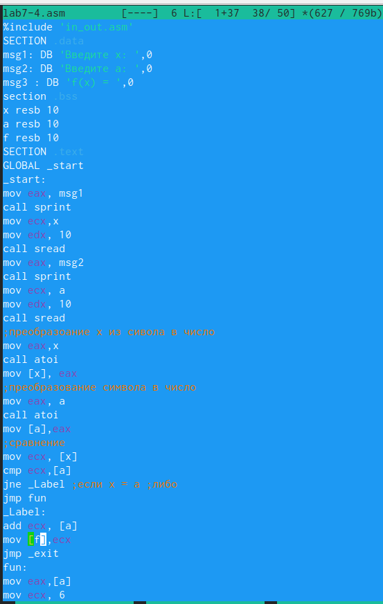{#fig:013 width=70%}

Результат выполнения данной программы:

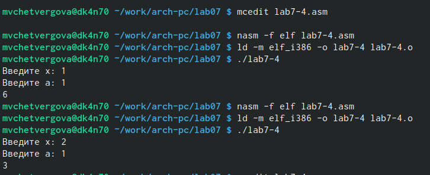{#fig:014 width=70%}

# Выводы

В ходе выполнения лабораторной работы №7 мы изучили команды условного и безусловного переходов, а также приобрели навыки написания
программ с использованием переходов и ознакомились с назначением и структурой файла листинга. Благодаря проделанной работе получены ценные навыки, позволяющие работать с условным и безусловным оператором на языке Nasm и программирование ветвлений. 

::: {#refs}
:::
