---
## Front matter
title: "Лабораторная работа №9"
subtitle: "Понятие подпрограммы.Отладчик GDB."
author: "Четвергова Мария Викторовна"

## Generic otions
lang: ru-RU
toc-title: "Содержание"

## Bibliography
bibliography: bib/cite.bib
csl: pandoc/csl/gost-r-7-0-5-2008-numeric.csl

## Pdf output format
toc: true # Table of contents
toc-depth: 2
lof: true # List of figures
lot: true # List of tables
fontsize: 12pt
linestretch: 1.5
papersize: a4
documentclass: scrreprt
## I18n polyglossia
polyglossia-lang:
  name: russian
  options:
	- spelling=modern
	- babelshorthands=true
polyglossia-otherlangs:
  name: english
## I18n babel
babel-lang: russian
babel-otherlangs: english
## Fonts
mainfont: PT Serif
romanfont: PT Serif
sansfont: PT Sans
monofont: PT Mono
mainfontoptions: Ligatures=TeX
romanfontoptions: Ligatures=TeX
sansfontoptions: Ligatures=TeX,Scale=MatchLowercase
monofontoptions: Scale=MatchLowercase,Scale=0.9
## Biblatex
biblatex: true
biblio-style: "gost-numeric"
biblatexoptions:
  - parentracker=true
  - backend=biber
  - hyperref=auto
  - language=auto
  - autolang=other*
  - citestyle=gost-numeric
## Pandoc-crossref LaTeX customization
figureTitle: "Рис."
tableTitle: "Таблица"
listingTitle: "Листинг"
lofTitle: "Список иллюстраций"
lotTitle: "Список таблиц"
lolTitle: "Листинги"
## Misc options
indent: true
header-includes:
  - \usepackage{indentfirst}
  - \usepackage{float} # keep figures where there are in the text
  - \floatplacement{figure}{H} # keep figures where there are in the text
---

# Цель работы

Приобретение навыков написания программ с использованием подпрограмм. Знакомство
с методами отладки при помощи GDB и его основными возможностями.

# Теоретическое введение

Отладка — это процесс поиска и исправления ошибок в программе. В общем случае его
можно разделить на четыре этапа:
• обнаружение ошибки;
• поиск её местонахождения;
• определение причины ошибки;
• исправление ошибки.
Можно выделить следующие типы ошибок:
• синтаксические ошибки — обнаруживаются во время трансляции исходного кода и
вызваны нарушением ожидаемой формы или структуры языка;
• семантические ошибки — являются логическими и приводят к тому, что программа
запускается, отрабатывает, но не даёт желаемого результата;
• ошибки в процессе выполнения — не обнаруживаются при трансляции и вызывают пре-
рывание выполнения программы (например, это ошибки, связанные с переполнением
или делением на ноль).
Второй этап — поиск местонахождения ошибки. Некоторые ошибки обнаружить доволь-
но трудно. Лучший способ найти место в программе, где находится ошибка, это разбить
программу на части и произвести их отладку отдельно друг от друга.
Третий этап — выяснение причины ошибки. После определения местонахождения ошибки
обычно проще определить причину неправильной работы программы.
Последний этап — исправление ошибки. После этого при повторном запуске программы,
может обнаружиться следующая ошибка, и процесс отладки начнётся заново

Наиболее часто применяют следующие методы отладки:
• создание точек контроля значений на входе и выходе участка программы (например,
вывод промежуточных значений на экран — так называемые диагностические сообще-
ния);
• использование специальных программ-отладчиков.
Отладчики позволяют управлять ходом выполнения программы, контролировать и из-
менять данные. Это помогает быстрее найти место ошибки в программе и ускорить её
исправление. Наиболее популярные способы работы с отладчиком — это использование
точек останова и выполнение программы по шагам.
Пошаговое выполнение — это выполнение программы с остановкой после каждой строчки,
чтобы программист мог проверить значения переменных и выполнить другие действия.
Точки останова — это специально отмеченные места в программе, в которых программа-
отладчик приостанавливает выполнение программы и ждёт команд. Наиболее популярные
виды точек останова:
• Breakpoint — точка останова (остановка происходит, когда выполнение доходит до
определённой строки, адреса или процедуры, отмеченной программистом);
• Watchpoint — точка просмотра (выполнение программы приостанавливается, если
программа обратилась к определённой переменной: либо считала её значение, либо
изменила его).
Точки останова устанавливаются в отладчике на время сеанса работы с кодом програм-
мы, т.е. они сохраняются до выхода из программы-отладчика или до смены отлаживаемой
программы

GDB (GNU Debugger — отладчик проекта GNU) [1] работает на многих UNIX-подобных
системах и умеет производить отладку многих языков программирования. GDB предлагает
обширные средства для слежения и контроля за выполнением компьютерных программ. От-
ладчик не содержит собственного графического пользовательского интерфейса и использует
стандартный текстовый интерфейс консоли. Однако для GDB существует несколько сторон-
них графических надстроек, а кроме того, некоторые интегрированные среды разработки
используют его в качестве базовой подсистемы отладки.
Отладчик GDB (как и любой другой отладчик) позволяет увидеть, что происходит «внутри»
программы в момент её выполнения или что делает программа в момент сбоя.
GDB может выполнять следующие действия:
• начать выполнение программы, задав всё, что может повлиять на её поведение;
• остановить программу при указанных условиях;
• исследовать, что случилось, когда программа остановилась

После запуска gdb выводит текстовое сообщение — так называемое «nice GDB logo». В
следующей строке появляется приглашение (gdb) для ввода команд.
Далее приведён список некоторых команд GDB.
Команда run (сокращённо r) — запускает отлаживаемую программу в оболочке GDB.

сли есть файл с исходным текстом программы, а в исполняемый файл включена информа-
ция о номерах строк исходного кода, то программу можно отлаживать, работая в отладчике
непосредственно с её исходным текстом. Чтобы программу можно было отлаживать на
уровне строк исходного кода, она должна быть откомпилирована с ключом -g.

Для продолжения остановленной программы используется команда continue (c) (gdb)
с . Выполнение программы будет происходить до следующей точки останова.
В качестве аргумента может использоваться целое число 𝑁, которое указывает отладчику
проигнорировать 𝑁 − 1 точку останова (выполнение остановится на 𝑁-й точке).
Команда stepi (кратко sI) позволяет выполнять программу по шагам, т.е. данная команда
выполняет ровно одну инструкцию

Чтобы посмотреть значения регистров используется команда print /F <val> (сокращен-
но p). Перед именем регистра обязательно ставится префикс $. Например, команда p/x $ecx
выводит значение регистра в шестнадцатеричном формате.
Изменить значение для регистра или ячейки памяти можно с помощью команды set,
задав ей в качестве аргумента имя регистра или адрес. При этом перед именем регистра
ставится префикс $, а перед адресом нужно указать в фигурных скобках тип данных (размер
сохраняемого значения; в качестве типа данных можно использовать типы языка Си).
Справку о любой команде gdb можно получить, ввод

Подпрограмма — это, как правило, функционально законченный участок кода, который
можно многократно вызывать из разных мест программы. В отличие от простых переходов
из подпрограмм существует возврат на команду, следующую за вызовом.
Если в программе встречается одинаковый участок кода, его можно оформить в виде
подпрограммы, а во всех нужных местах поставить её вызов. При этом подпрограмма бу-
дет содержаться в коде в одном экземпляре, что позволит уменьшить размер кода всей
программы.

Важно помнить, что если в подпрограмме занести что-то в стек и не извлечь, то на вершине
стека окажется не адрес возврата и это приведёт к ошибке выхода из подпрограммы. Кроме
того, надо помнить, что подпрограмма без команды возврата не вернётся в точку вызова, а
будет выполнять следующий за подпрограммой код, как будто он является её продолжением

# Выполнение лабораторной работы

1. Создайте каталог для выполнения лабораторной работы № 9, перейдите в него и со-
здайте файл lab09-1.asm:

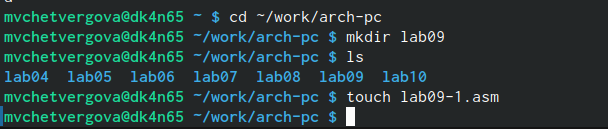{#fig:001 width=70%}

2. В качестве примера рассмотрим программу вычисления арифметического выражения
𝑓(𝑥) = 2𝑥 + 7 с помощью подпрограммы _calcul. В данном примере 𝑥 вводится с
клавиатуры, а само выражение вычисляется в подпрограмме. Внимательно изучите
текст программы (Листинг 9.1).

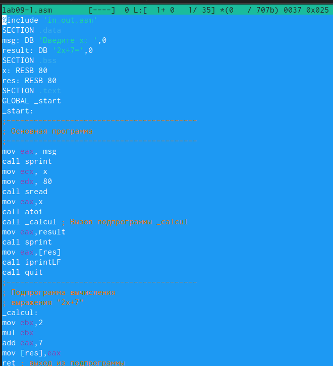{#fig:002 width=70%}

Первые строки программы отвечают за вывод сообщения на экран (call sprint), чтение
данных введенных с клавиатуры (call sread) и преобразования введенных данных из
символьного вида в численный (call atoi)

После следующей инструкции call _calcul, которая передает управление подпрограмме
_calcul, будут выполнены инструкции подпрограммы

mov ebx,2
mul ebx
add eax,7
mov [res],eax
ret

Инструкция ret является последней в подпрограмме и ее исполнение приводит к воз-
вращению в основную программу к инструкции, следующей за инструкцией call, которая
вызвала данную подпрограмму.
Последние строки программы реализую вывод сообщения (call sprint), результата вы-
числения (call iprintLF) и завершение программы (call quit).
Введите в файл lab09-1.asm текст программы из листинга 9.1. Создайте исполняемый
файл и проверьте его работу.

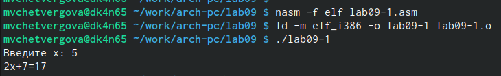{#fig:003 width=70%}

Измените текст программы, добавив подпрограмму _subcalcul в подпрограмму _calcul,
для вычисления выражения 𝑓(𝑔(𝑥)), где 𝑥 вводится с клавиатуры, 𝑓(𝑥) = 2𝑥 + 7, 𝑔(𝑥) =
3𝑥 − 1. Т.е. 𝑥 передается в подпрограмму _calcul из нее в подпрограмму _subcalcul, где
вычисляется выражение 𝑔(𝑥), результат возвращается в _calcul и вычисляется выражение
𝑓(𝑔(𝑥)). Результат возвращается в основную программу для вывода результата на экран.

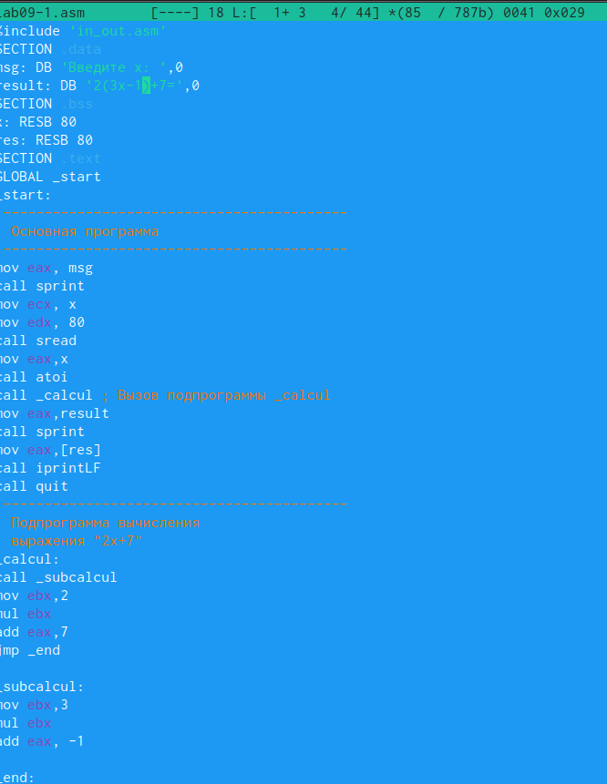{#fig:004 width=70%}

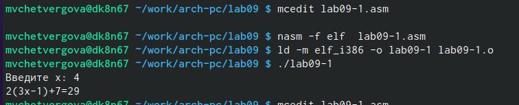{#fig:005 width=70%}

##Отладка программам с помощью GDB
Создайте файл lab09-2.asm с текстом программы из Листинга 9.2. (Программа печати
сообщения Hello world!)

Листинг 9.2. Программа вывода сообщения Hello world!

SECTION .data
msg1: db "Hello, ",0x0
msg1Len: equ $ - msg1
msg2: db "world!",0xa
msg2Len: equ $ - msg2
SECTION .text
global _start
_start:
mov eax, 4
mov ebx, 1
mov ecx, msg1
mov edx, msg1Len
int 0x80
mov eax, 4
mov ebx, 1
mov ecx, msg2
mov edx, msg2Len
int 0x80
mov eax, 1
mov ebx, 0
int 0x80

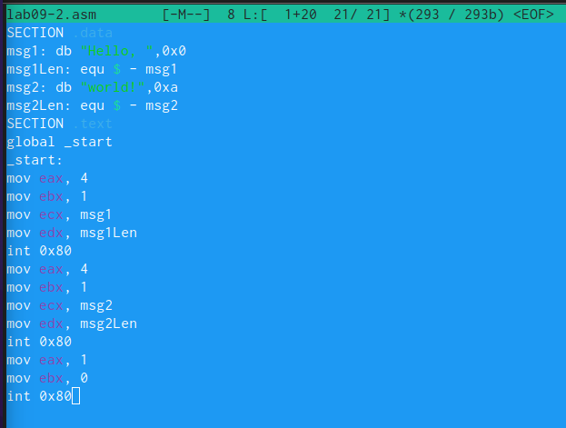{#fig:006 width=70%}

Получите исполняемый файл. Для работы с GDB в исполняемый файл необходимо добавить
отладочную информацию, для этого трансляцию программ необходимо проводить с ключом
‘-g’. Затем Загрузим исполняемый файл в отладчик gdb.

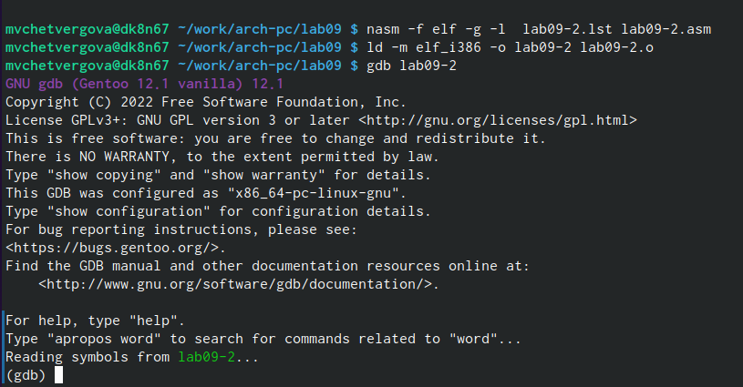{#fig:007 width=70%}

Проверим работу программы, запустив ее в оболочке GDB с помощью команды run (со-
кращённо r):

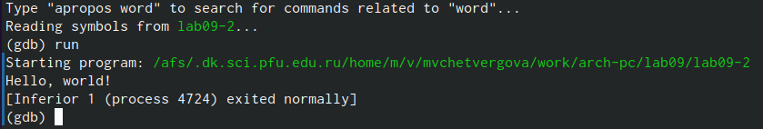{#fig:008 width=70%}

Для более подробного анализа программы установите брейкпоинт на метку _start, с
которой начинается выполнение любой ассемблерной программы, и запустите её:

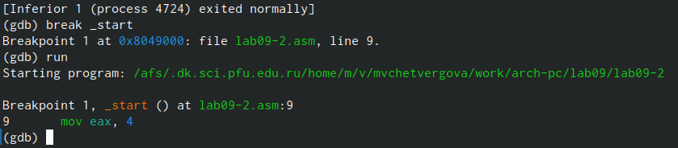{#fig:009 width=70%}

Посмотрите дисассимилированный код программы с помощью команды disassemble
начиная с метки _start и переключитесь на отображение команд с Intel’овским синтаксисом, введя команду set

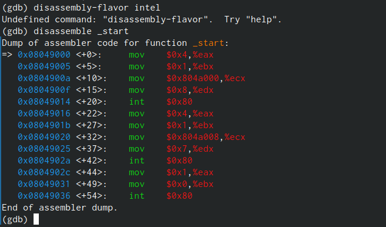{#fig:010 width=70%}

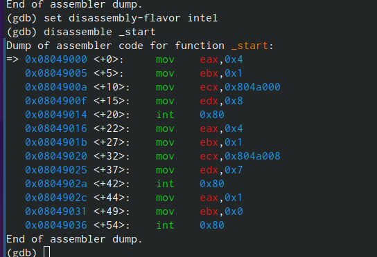{#fig:011 width=70%}

Перечислите различия отображения синтаксиса машинных команд в режимах ATT и Intel.
различия заключаются в записи последнего столбца: регистры и машинный код стоят на рвзных местах. также, в INTEL-овсков варианте запись визуально воспринимается проще: машинный код выделен синим цветом и не сливается со столбиком регистров и в нём нет посторонних символов типа "%" или "$".

Включите режим псевдографики для более удобного анализа программы (рис. 9.2):

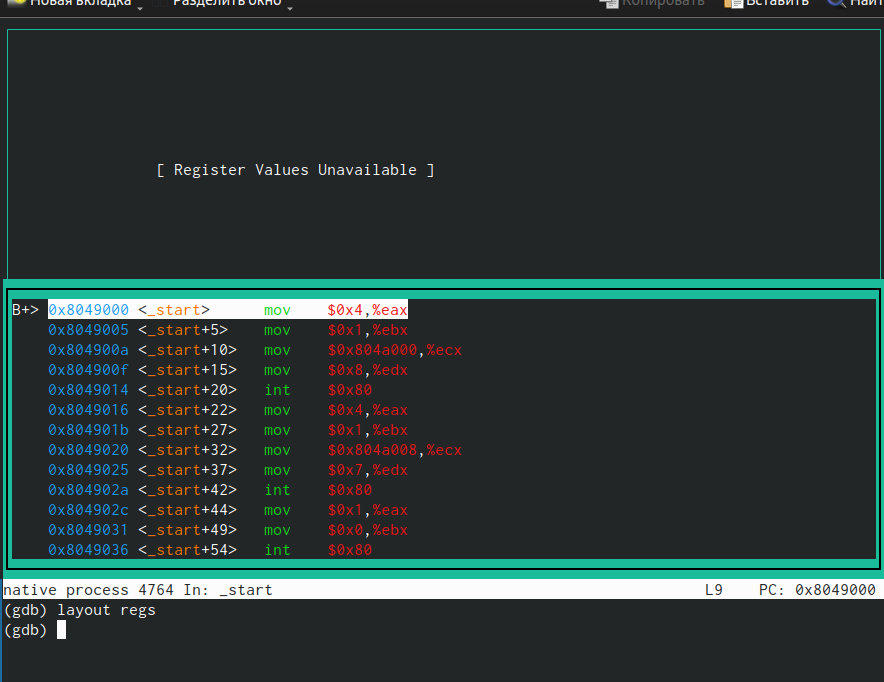{#fig:012 width=70%}

В этом режиме есть три окна:
• В верхней части видны названия регистров и их текущие значения;
• В средней части виден результат дисассимилирования программы;
• Нижняя часть доступна для ввода команд.

## Добавление точек останова
Установить точку останова можно командой break (кратко b). Типичный аргумент этой
команды — место установки. Его можно задать или как номер строки программы (имеет
смысл, если есть исходный файл, а программа компилировалась с информацией об отладке),
или как имя метки, или как адрес. Чтобы не было путаницы с номерами, перед адресом
ставится «звёздочка»:
На предыдущих шагах была установлена точка останова по имени метки (_start). Про-
верьте это с помощью команды info breakpoints (кратко i b):

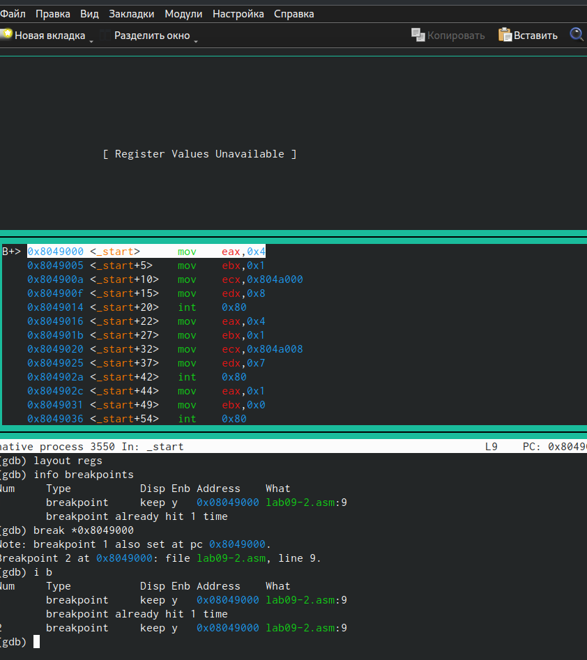{#fig:013 width=70%}

Установим еще одну точку останова по адресу инструкции. Адрес инструкции можно
увидеть в средней части экрана в левом столбце соответствующей инструкции (см. рис. 9.3).
Определите адрес предпоследней инструкции (mov ebx,0x0) и установите точку останова. Посмотрите информацию о всех установленных точках останова:

{#fig:013 width=70%}

## Работа с данными программы в GDB
Отладчик может показывать содержимое ячеек памяти и регистров, а при необходимости
позволяет вручную изменять значения регистров и переменных.
Выполните 5 инструкций с помощью команды stepi (или si) и проследите за изменением
значений регистров. Значения каких регистров изменяются? изменяются значения регистров определённых элементов
Посмотреть содержимое регистров также можно с помощью команды info registers
(или i r).

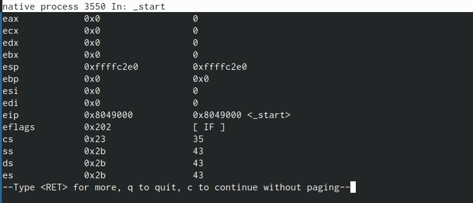{#fig:014 width=70%}

Для отображения содержимого памяти можно использовать команду x <адрес>, которая
выдаёт содержимое ячейки памяти по указанному адресу. Формат, в котором выводятся
данные, можно задать после имени команды через косую черту: x/NFU <адрес>.
С помощью команды x &<имя переменной> также можно посмотреть содержимое пере-
менной.
Посмотрите значение переменной msg1 по имени и значение переменной msg2 по адресу. 

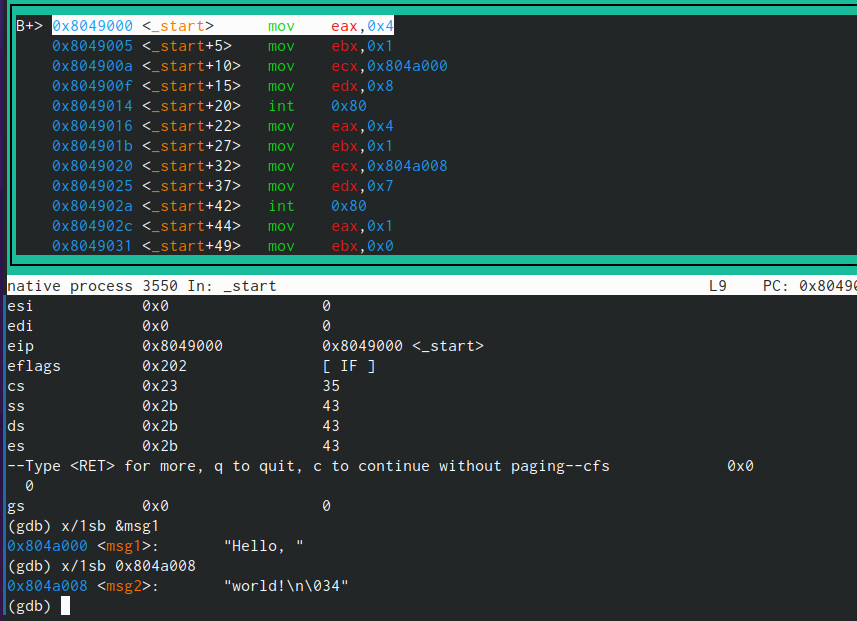{#fig:015 width=70%}

Адрес переменной можно определить по дизассемблированной инструкции. Посмотрите инструкцию mov ecx,msg2 которая записывает в регистр ecx адрес перемененной msg2.  Изменить значение для регистра или ячейки памяти можно с помощью команды set,
задав ей в качестве аргумента имя регистра или адрес. При этом перед именем регистра
ставится префикс $, а перед адресом нужно указать в фигурных скобках тип данных (раз-
мер сохраняемого значения; в качестве типа данных можно использовать типы языка Си).
Измените первый символ переменной msg1 

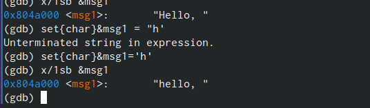{#fig:016 width=70%}

Заменим первый символ во второй переменной msg2

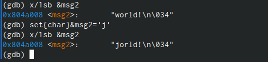{#fig:017 width=70%}

Чтобы посмотреть значения регистров используется команда print (перед име-
нем регистра обязательно ставится префикс $)
Выведете в различных форматах (в шестнадцатеричном формате, в двоичном формате и
в символьном виде) значение регистра edx.
С помощью команды set измените значение регистра ebx:

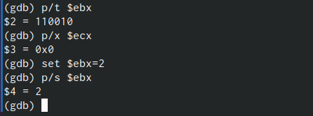{#fig:018 width=70%}

Объясните разницу вывода команд p/s $ebx:
Через p/s выводится только значение регистра и его значение в указанной СС.При выводе через 
x/1sb  выводится адрес переменной, её название и машинный код.

Завершите выполнение программы с помощью команды continue (сокращенно c) или
stepi (сокращенно si) и выйдите из GDB с помощью команды quit (сокращенно q).

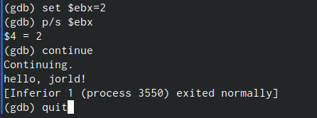{#fig:019 width=70%}

##Обработка аргументов командной строки в GDB
Скопируйте файл lab8-2.asm, созданный при выполнении лабораторной работы No8,
с программой выводящей на экран аргументы командной строки (Листинг 8.2) в файл с
именем lab09-3.asm и создайте исполняемый файл. Для загрузки в gdb программы с аргументами необходимо использовать ключ --args. Загрузите исполняемый файл в отладчик, указав аргументы:

{#fig:020 width=70%}

Как отмечалось в предыдущей лабораторной работе, при запуске программы аргументы
командной строки загружаются в стек. Исследуем расположение аргументов командной
строки в стеке после запуска программы с помощью gdb.
Для начала установим точку останова перед первой инструкцией в программе и запустим
ее (см. рис. 20).

Адрес вершины стека храниться в регистре esp и по этому адресу располагается число
равное количеству аргументов командной строки (включая имя программы)
Число аргументов равно 5 – это имя программы lab09-3 и непосредственно
аргументы: аргумент1, аргумент, 2 и 'аргумент 3'.
Посмотрите остальные позиции стека – по адесу [esp+4] располагается адрес в памяти
где находиться имя программы, по адесу [esp+8] храниться адрес первого аргумента, по
аресу [esp+12] – второго и т.д.

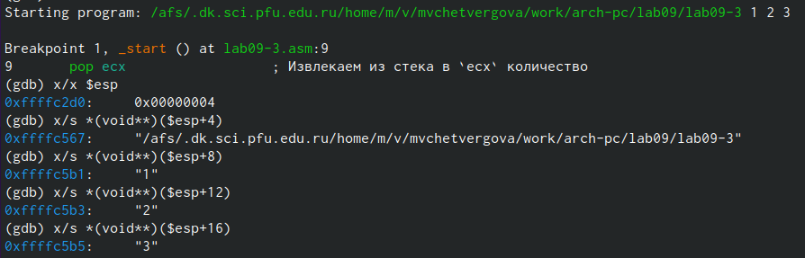{#fig:021 width=70%}

## Задание для самостоятельной работы
1. Преобразуйте программу из лабораторной работы No8 (Задание No1 для самостоятель-
ной работы), реализовав вычисление значения функции 𝑓(𝑥) как подпрограмму.

шаг 1 - рассмотрим листинг программы до изменений. 

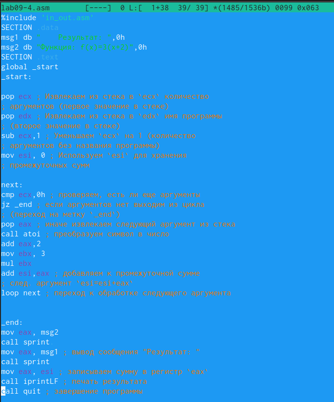{#fig:022 width=70%}

шаг 2 - создадим подпрограмму _steps, которая будет производить вычисления. 
После того, как программа берёт следующий элемент из стека, этот элемент проходит через подпрограмму 
_steps , а затем записывается в сумму всех предыущих элементов (esi). Подпрограмма записанан в самом конце.

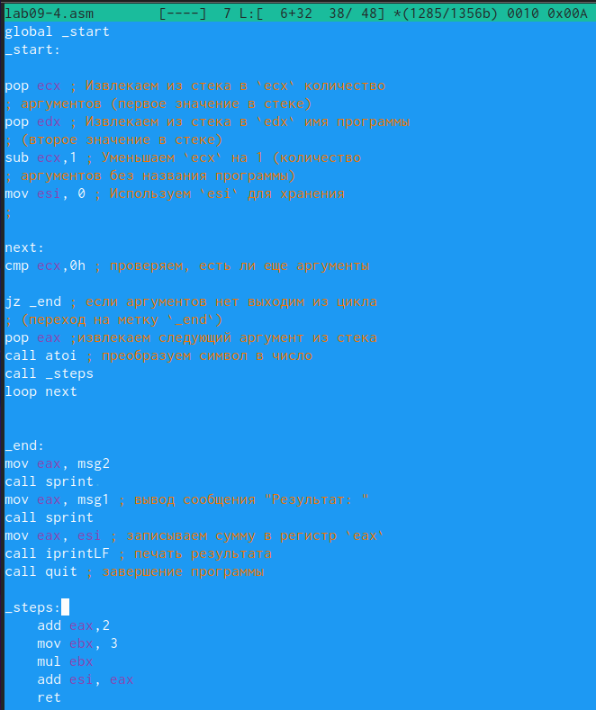{#fig:023 width=70%}

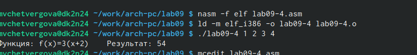{#fig:024 width=70%}

2. В листинге 9.3 приведена программа вычисления выражения (3 + 2) ∗ 4 + 5. При запуске
данная программа дает неверный результат. Проверьте это. С помощью отладчика GDB,
анализируя изменения значений регистров, определите ошибку и исправьте ее.

шаг 1 - запишем листинг в редактор NASM и проверим работу этого файла. Действительно, в коде допущена ошибка: программа должна выводит число 25, но выводится число 54.

листинг программы:

%include 'in_out.asm'
SECTION .data
div: DB 'Результат: ',0
SECTION .text
GLOBAL _start
_start:
; ---- Вычисление выражения (3+2)*4+5
mov ebx,3
mov eax,2
add ebx,eax
mov ecx,4
mul ecx
add ebx,5
mov edi,ebx
; ---- Вывод результата на экран
mov eax,div
call sprint
mov eax,edi
call iprintLF
call quit

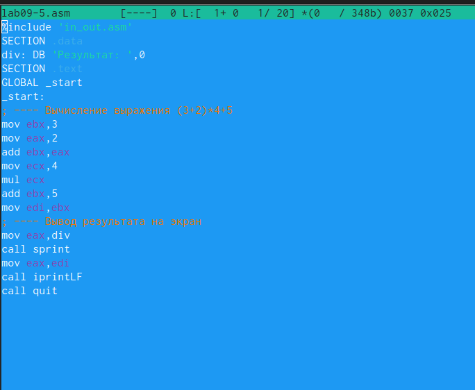{#fig:025 width=70%}

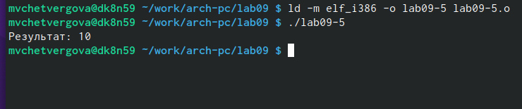{#fig:026 width=70%}

шаг 2 - откроем режим пседографики и расставим брейкпоинты на каждом арифметическом действии. С помощью команды continue пройдёмся по каждому шагу, чтобы понять, в какой момент произошла ошибка. 

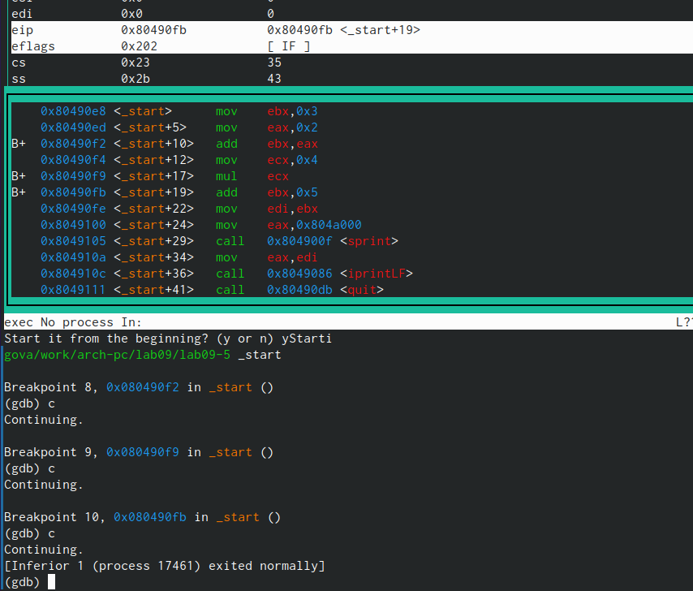{#fig:027 width=70%}

шаг 3 - ошибка заключается в том, что в строке под адресом 0х804490f2 значение eax записывается в ebx, хотя должно быть наоборот. Исправим это в редакторе NASM. Проверим работу исправного файла.

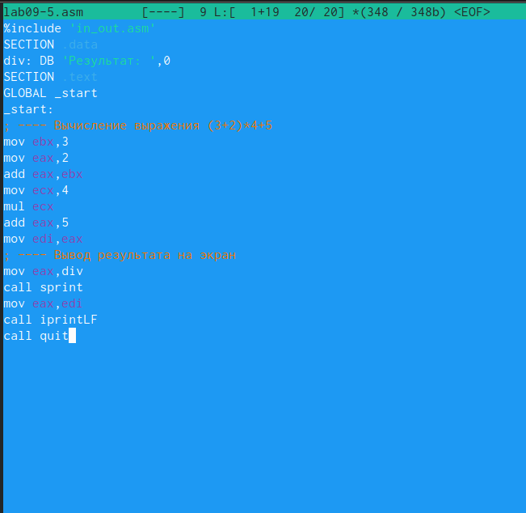{#fig:028 width=70%}

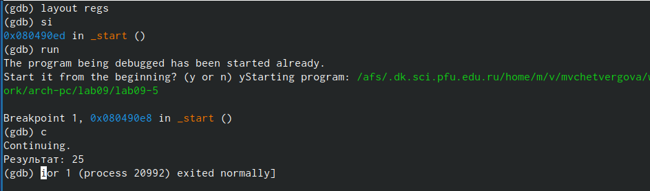{#fig:029 width=70%}

# Выводы
В ходе выполнения лабораторной работы №9 мы не только приобрели навыки написания программ с использованием подпрограмм, но и ознакомились с методами отладки при помощи GDB и его основными возможностями.

{.unnumbered}

::: {#refs}
:::
