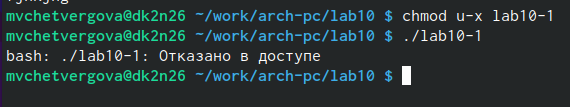

---
## Front matter
title: "Лабораторная работа No10"
subtitle: "Работа с файлами средствами Nasm"
author: "Четвергова Мария Викторовна"

## Generic otions
lang: ru-RU
toc-title: "Содержание"

## Bibliography
bibliography: bib/cite.bib
csl: pandoc/csl/gost-r-7-0-5-2008-numeric.csl

## Pdf output format
toc: true # Table of contents
toc-depth: 2
lof: true # List of figures
lot: true # List of tables
fontsize: 12pt
linestretch: 1.5
papersize: a4
documentclass: scrreprt
## I18n polyglossia
polyglossia-lang:
  name: russian
  options:
	- spelling=modern
	- babelshorthands=true
polyglossia-otherlangs:
  name: english
## I18n babel
babel-lang: russian
babel-otherlangs: english
## Fonts
mainfont: PT Serif
romanfont: PT Serif
sansfont: PT Sans
monofont: PT Mono
mainfontoptions: Ligatures=TeX
romanfontoptions: Ligatures=TeX
sansfontoptions: Ligatures=TeX,Scale=MatchLowercase
monofontoptions: Scale=MatchLowercase,Scale=0.9
## Biblatex
biblatex: true
biblio-style: "gost-numeric"
biblatexoptions:
  - parentracker=true
  - backend=biber
  - hyperref=auto
  - language=auto
  - autolang=other*
  - citestyle=gost-numeric
## Pandoc-crossref LaTeX customization
figureTitle: "Рис."
tableTitle: "Таблица"
listingTitle: "Листинг"
lofTitle: "Список иллюстраций"
lotTitle: "Список таблиц"
lolTitle: "Листинги"
## Misc options
indent: true
header-includes:
  - \usepackage{indentfirst}
  - \usepackage{float} # keep figures where there are in the text
  - \floatplacement{figure}{H} # keep figures where there are in the text
---

# Цель работы

Приобретение навыков написания программ для работы с файлами.
В ходе выполнения  лабораторной работы №10 необходимо научиться работать с файлами и написать программы, работа

# Теоретическое введение

ОС GNU/Linux является многопользовательской операционной системой. И для обеспече-
ния защиты данных одного пользователя от действий других пользователей существуют
специальные механизмы разграничения доступа к файлам. Кроме ограничения доступа, дан-
ный механизм позволяет разрешить другим пользователям доступ данным для совместной
работы.
Права доступа определяют набор действий (чтение, запись, выполнение), разрешённых
для выполнения пользователям системы над файлами. Для каждого файла пользователь
может входить в одну из трех групп: владелец, член группы владельца, все остальные. Для
каждой из этих групп может быть установлен свой набор прав доступа. Владельцем файла
является его создатель. Для предоставления прав доступа другому пользователю или другой
группе командой
chown ключи новый_пользователь [:новая_группа] <файл>
или
chgrp ключи  новая_группа > <файл>
Набор прав доступа задается тройками битов и состоит из прав на чтение, запись и ис-
полнение файла. В символьном представлении он имеет вид строк rwx, где вместо любого
символа может стоять дефис. Всего возможно 8 комбинаций, приведенных в таблице 10.1.
Буква означает наличие права (установлен в единицу второй бит триады r — чтение, первый
бит w — запись, нулевой бит х — исполнение), а дефис означает отсутствие права (нулевое
значение соответствующего бита). Также права доступа могут быть представлены как вось-
меричное число. Так, права доступа rw- (чтение и запись, без исполнения) понимаются как
три двоичные цифры 110 или как восьмеричная цифра 6.

Полная строка прав доступа в символьном представлении имеет вид:
<права_владельца> <права_группы> <права_остальных>
Так, например, права rwx r-x --x выглядят как двоичное число 111 101 001, или вось-
меричное 751.
Свойства (атрибуты) файлов и каталогов можно вывести на терминал с помощью команды
ls с ключом -l. Так например, чтобы узнать права доступа к файлу README можно узнать с
помощью следующей команды:
$ls -l /home/debugger/README
-rwxr-xr-- 1 debugger users 0 Feb 14 19:08 /home/debugger/README
В первой колонке показаны текущие права доступа, далее указан владелец файла и группа:
Тип файла определяется первой позицией, это может быть: каталог — d, обычный файл
— дефис (-) или символьная ссылка на другой файл — l. Следующие 3 набора по 3 символа
определяют конкретные права для конкретных групп: r — разрешено чтение файла, w —
разрешена запись в файл; x — разрешено исполнение файл и дефис (-) — право не дано.
Для изменения прав доступа служит команда chmod, которая понимает как символьное,
так и числовое указание прав. Для того чтобы назначить файлу /home/debugger/README
права rw-r, то есть разрешить владельцу чтение и запись, группе только чтение, остальным
пользователям — ничего:

В символьном представлении есть возможность явно указывать какой группе какие права
необходимо добавить, отнять или присвоить. Например, чтобы добавить право на исполне-
ние файла README группе и всем остальным:

В операционной системе Linux существуют различные методы управления файлами, на-
пример, такие как создание и открытие файла, только для чтения или для чтения и записи,
добавления в существующий файл, закрытия и удаления файла, предоставление прав досту-
па

Обработка файлов в операционной системе Linux осуществляется за счет использования
определенных системных вызовов. Для корректной работы и доступа к файлу при его от-
крытии или создании, файлу присваивается уникальный номер (16-битное целое число) –
дескриптор файла.
В таблице 10.3 приведены системные вызовы для обработки файло

Общий алгоритм работы с системными вызовами в Nasm можно представить в следующем
виде:
1. Поместить номер системного вызова в регистр EAX;
2. Поместить аргументы системного вызова в регистрах EBX, ECX и EDX;
3. Вызов прерывания (int 80h);
4. Результат обычно возвращается в регистр EAX

Для открытия существующего файла служит системный вызов sys_open, который исполь-
зует следующие аргументы: права доступа к файлу в регистре EDX, режим доступа к файлу в
регистр ECX, имя файла в EBX и номер системного вызова sys_open (5) в EAX.
Среди режимов доступа к файлам чаще всего используются:
• (0) – O_RDONLY (открыть файл в режиме только для чтения);
• (1) – O_WRONLY – (открыть файл в режиме только записи);
• (2) – O_RDWR – (открыть файл в режиме чтения и записи).
С другими режимами доступа можно ознакомиться в https://man7.org/.
Системный вызов возвращает файловый дескриптор открытого файла в регистр EAX. В
случае ошибки, код ошибки также будет находиться в регистре EAX

Для записи в файл служит системный вызов sys_write, который использует следующие
аргументы: количество байтов для записи в регистре EDX, строку содержимого для записи
ECX, файловый дескриптор в EBX и номер системного вызова sys_write (4) в EAX.
Системный вызов возвращает фактическое количество записанных байтов в регистр EAX.
В случае ошибки, код ошибки также будет находиться в регистре EAX.
Прежде чем записывать в файл, его необходимо создать или открыть, что позволит полу-
чить дескриптор файла.

Для чтения данных из файла служит системный вызов sys_read, который использует
следующие аргументы: количество байтов для чтения в регистре EDX, адрес в памяти для
записи прочитанных данных в ECX, файловый дескриптор в EBX и номер системного вызова
sys_read (3) в EAX. Как и для записи, прежде чем читать из файла, его необходимо открыть,
что позволит получить дескриптор файла.

Для правильного закрытия файла служит системный вызов sys_close, который использует
один аргумент – дескриптор файла в регистре EBX. После вызова ядра происходит удаление
дескриптора файла, а в случае ошибки, системный вызов возвращает код ошибки в регистр
EAX

Для изменения содержимого файла служит системный вызов sys_lseek, который исполь-
зует следующие аргументы: исходная позиция для смещения EDX, значение смещения в
байтах в ECX, файловый дескриптор в EBX и номер системного вызова sys_lseek (19) в EAX.
Значение смещения можно задавать в байтах. Значения обозначающие исходную позиции
могут быть следующими

# Выполнение лабораторной работы

1. Создайте каталог для программам лабораторной работы No 10, перейдите в него и
создайте файлы lab10-1.asm, readme-1.txt и readme-2.txt:

{#fig:001 width=70%}

2. Введите в файл lab10-1.asm текст программы из листинга 10.1 (Программа записи в
файл сообщения). Создайте исполняемый файл и проверьте его работу.

{#fig:002 width=70%}

{#fig:003 width=70%}

3. С помощью команды chmod измените права доступа к исполняемому файлу lab10-1,
запретив его выполнение. Попытайтесь выполнить файл. Объясните результат.

{#fig:004 width=70%}

{#fig:005 width=70%}

4. С помощью команды chmod измените права доступа к файлу lab10-1.asm с исходным
текстом программы, добавив права на исполнение. Попытайтесь выполнить его и
объясните результат.

{#fig:006 width=70%}

{#fig:007 width=70%}

5. В соответствии с вариантом в таблице 10.4 предоставить права доступа к файлу readme-
1.txt представленные в символьном виде, а для файла readme-2.txt – в двочном виде.
Проверить правильность выполнения с помощью команды ls -l

{#fig:008 width=70%}

{#fig:009 width=70%}

# Выводы

Здесь кратко описываются итоги проделанной работы.

# Список литературы{.unnumbered}

::: {#refs}
:::
